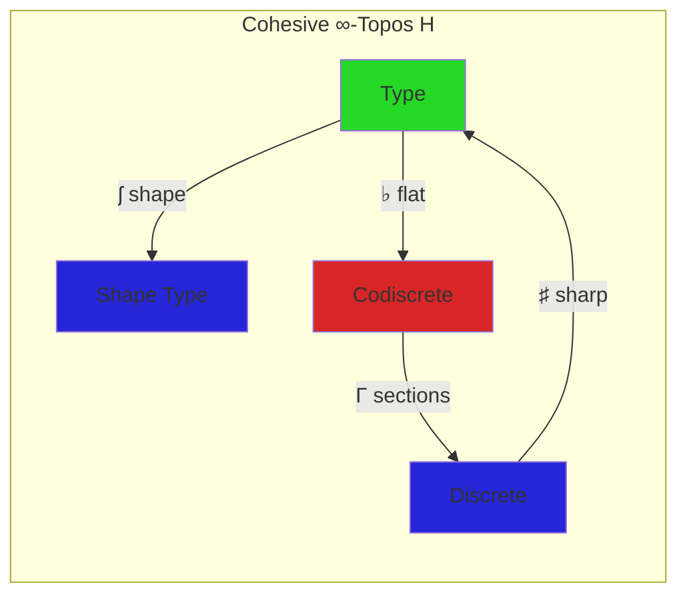
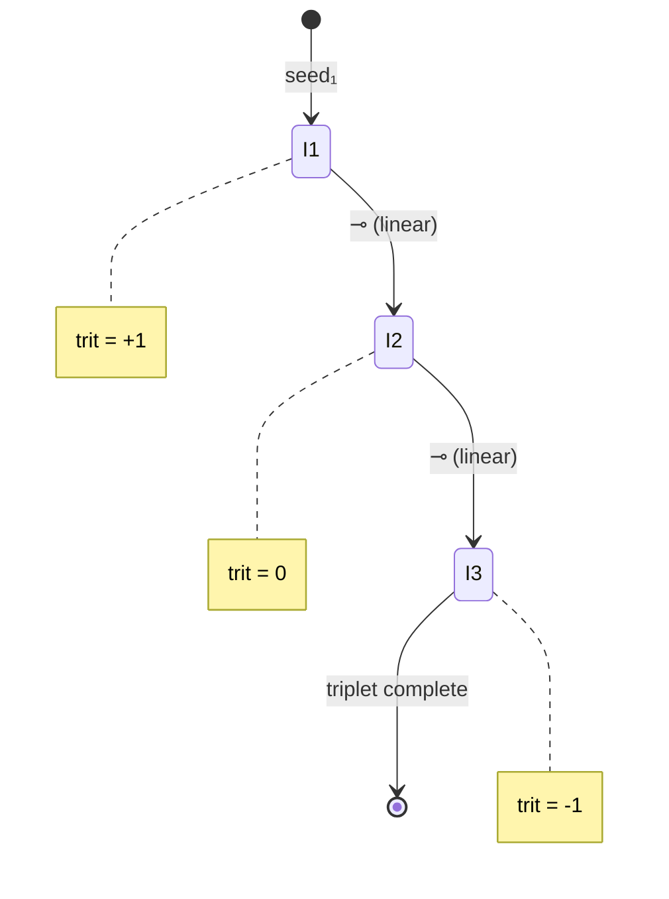

# LHoTT Cohesive Linear Skill

Synthesizes Urs Schreiber's cohesive ∞-topos framework with Mitchell Riley's linear HoTT for interaction entropy formalization.

## Modal Operators

| Modality | Symbol | Action | Interaction Use |
|----------|--------|--------|-----------------|
| Sharp | ♯ | Discretize | Extract trit from color |
| Flat | ♭ | Embed continuously | Full LCH embedding |
| Shape | ʃ | Quotient by homotopy | Walk trajectory class |
| Linear | ♮ | Self-adjoint tangent | One-use interaction |

## GF(3) Triad Placement

This skill is **ERGODIC (0)**, forming triads with:

```
persistent-homology (-1) ⊗ lhott-cohesive-linear (0) ⊗ topos-generate (+1) = 0 ✓
sheaf-cohomology (-1) ⊗ lhott-cohesive-linear (0) ⊗ gay-mcp (+1) = 0 ✓
three-match (-1) ⊗ lhott-cohesive-linear (0) ⊗ rubato-composer (+1) = 0 ✓
```

## Core Types (Pseudo-HoTT)

```hott
-- Cohesive interaction type
CohesiveInteraction : Type
  content : String
  hash : ♯ SHA256           -- discrete
  seed : ♭ UInt64           -- continuous embedding
  color : ♮ LCH             -- linear (used once)
  position : ʃ (ℤ × ℤ)      -- shape-invariant

-- Linear function (no copy/delete)
walk_step : CohesiveInteraction ⊸ Position × Color

-- Bunched triplet (entangled context)
Γ₁ ⊗ Γ₂ ⊗ Γ₃ ⊢ conserved : GF3Zero
  where trit(Γ₁) + trit(Γ₂) + trit(Γ₃) ≡ 0 (mod 3)
```

## Diagram Generation

### Mermaid Templates

**Cohesive Quadruple:**


**Linear Walk:**


**Bunched Context T