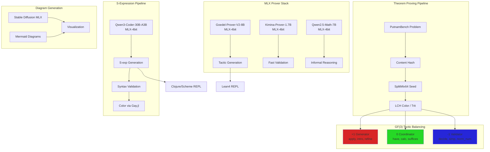

# MLX-Convertible Models for Proof & S-Expression Construction

**Date**: 2025-12-22
**Status**: Research Complete

## Executive Summary

This document identifies LLMs and diffusion models that can run on Apple Silicon via MLX for:
1. **Theorem proving** (Lean4 tactic generation, PutnamBench integration)
2. **S-expression construction** (Clojure/Scheme/Lisp code generation)
3. **Diagram generation** (Mermaid, DisCoPy visualization)

---

## Part 1: Theorem Prover LLMs

### Tier 1: Immediately MLX-Convertible (Qwen3 Architecture)

| Model | Size | PutnamBench | MLX Status | Notes |
|-------|------|-------------|------------|-------|
| **Goedel-Prover-V2-8B** | 8B | 86 (pass@184) | ✅ Qwen3 base → MLX-ready | Best open-source performance |
| **Goedel-Prover-V2-32B** | 32B | Higher | ✅ Qwen3 base → MLX-ready | Needs 64GB+ RAM |
| **Kimina-Prover-Distill-8B** | 8B | miniF2F 80.7% | ✅ Qwen3 base → MLX-ready | AI-MO competition winner |
| **Kimina-Prover-Distill-1.7B** | 1.7B | Good | ✅ Qwen3 base → MLX-ready | Lightweight, fast |
| **Kimina-Prover-Distill-0.6B** | 0.6B | Baseline | ✅ Qwen3 base → MLX-ready | Ultra-lightweight |

**Conversion Command**:
```bash
# Using mlx-lm to convert
pip install mlx-lm
mlx_lm.convert --hf-path Goedel-LM/Goedel-Prover-V2-8B --mlx-path ./goedel-prover-8b-mlx
```

### Tier 2: DeepSeek Prover (LLaMA Architecture)

| Model | Size | PutnamBench | MLX Status | Notes |
|-------|------|-------------|------------|-------|
| **DeepSeek-Prover-V2-7B** | 7B | 47 (pass@1024) | ✅ LLaMA arch → MLX-ready | RL-trained, subgoal decomposition |
| DeepSeek-Prover-V1.5-RL | 7B | ~30 | ✅ LLaMA arch → MLX-ready | Previous gen |
| DeepSeek-Prover-V2-671B | 671B | Higher | ⚠️ MoE, needs special handling | Too large for local |

**GGUF Available**: `unsloth/DeepSeek-Prover-V2-7B-GGUF` for llama.cpp

### Tier 3: Math Reasoning Base Models

| Model | Size | Strength | MLX Status |
|-------|------|----------|------------|
| **Qwen2.5-Math-7B-Instruct** | 7B | General math | ✅ Already in mlx-community |
| **Qwen2.5-Math-1.5B-Instruct** | 1.5B | Lightweight | ✅ GGUF available |
| Qwen2.5-Math-72B-Instruct | 72B | SOTA math | ⚠️ Needs 128GB+ RAM |

### Tier 4: Code Generation for S-Expressions

| Model | Size | Lisp/Scheme | MLX Status |
|-------|------|-------------|------------|
| **Qwen3-Coder-30B-A3B** | 30B (3B active) | Excellent code | ✅ MLX-4bit available |
| **Devstral-Small-2-24B** | 24B | Good code | ✅ MLX-4bit available |
| **DeepSeek-R1-0528-Qwen3-8B** | 8B | Reasoning + code | ✅ MLX-4/8bit available |

---

## Part 2: Existing MLX Models (Ready to Use)

### LM Studio Community MLX Models

| Model | Downloads | Use Case |
|-------|-----------|----------|
| `lmstudio-community/DeepSeek-R1-0528-Qwen3-8B-MLX-4bit` | 224K | Reasoning chains |
| `lmstudio-community/Qwen3-Coder-30B-A3B-Instruct-MLX-4bit` | 124K | Code generation |
| `lmstudio-community/NVIDIA-Nemotron-3-Nano-30B-A3B-MLX-4bit` | 124K | General + code |
| `lmstudio-community/gemma-3n-E4B-it-MLX-4bit` | 115K | Multimodal |
| `mlx-community/gpt-oss-20b-MXFP4-Q8` | 724K | General |

### Vision-Language for Diagram Understanding

| Model | Downloads | Use Case |
|-------|-----------|----------|
| `lmstudio-community/Qwen3-VL-8B-Instruct-MLX-4bit` | 149K | Diagram → code |
| `lmstudio-community/Qwen3-VL-4B-Instruct-MLX-4bit` | 215K | Lightweight vision |
| `lmstudio-community/Qwen3-VL-30B-A3B-Instruct-MLX-4bit` | 99K | Complex diagrams |

---

## Part 3: Diffusion Models for MLX

### Image/Diagram Generation

| Model | Framework | MLX Status | Use Case |
|-------|-----------|------------|----------|
| **Stable Diffusion 1.5** | Core ML / MLX | ✅ Native Apple support | General generation |
| **SDXL** | Core ML / MLX | ✅ Via ComfyUI-MLX | Higher quality |
| **SD 3.5** | Core ML | ✅ Via Comfy-Org | Latest architecture |

**Key Resources**:
- `apple/ml-stable-diffusion` - Official Apple implementation
- `bitanath/mlx-stable-diffusion` - Pure MLX SD 1.5
- ComfyUI-MLX extension - 70% faster on Apple Silicon

### Text Rendering (for Diagrams with Text)

| Model | Capability | Status |
|-------|------------|--------|
| **FLUX** | Best text rendering | Core ML conversion possible |
| **Qwen-Image-Lightning** | Fast generation | Available via HF Spaces |

---

## Part 4: Integration Architecture



---

## Part 5: Recommended Setup

### Minimum (M1/M2 16GB)

```bash
# Lightweight prover stack
mlx_lm.convert --hf-path AI-MO/Kimina-Prover-Distill-1.7B -q --mlx-path ./kimina-1.7b-4bit
mlx_lm.convert --hf-path Qwen/Qwen2.5-Math-1.5B-Instruct -q --mlx-path ./qwen-math-1.5b-4bit
```

**Total VRAM**: ~4GB

### Recommended (M2/M3 Pro 32GB)

```bash
# Full prover stack
mlx_lm.convert --hf-path Goedel-LM/Goedel-Prover-V2-8B -q --mlx-path ./goedel-8b-4bit
mlx_lm.convert --hf-path deepseek-ai/DeepSeek-Prover-V2-7B -q --mlx-path ./deepseek-prover-7b-4bit
mlx_lm.convert --hf-path Qwen/Qwen2.5-Math-7B-Instruct -q --mlx-path ./qwen-math-7b-4bit
```

**Total VRAM**: ~12GB

### Maximum (M2/M3 Max 64GB+)

```bash
# SOTA stack with 32B models
mlx_lm.convert --hf-path Goedel-LM/Goedel-Prover-V2-32B -q --mlx-path ./goedel-32b-4bit
mlx_lm.convert --hf-path AI-MO/Kimina-Prover-72B -q --mlx-path ./kimina-72b-4bit
```

**Total VRAM**: ~40GB

---

## Part 6: Justfile Commands

```just
# ═══════════════════════════════════════════════════════════════════════════════
# MLX PROVER MODELS
# ═══════════════════════════════════════════════════════════════════════════════

# Download and convert Goedel-Prover-V2-8B to MLX
mlx-goedel-8b:
    pip install mlx-lm
    mlx_lm.convert --hf-path Goedel-LM/Goedel-Prover-V2-8B -q --mlx-path ./models/goedel-8b-4bit

# Download Kimina-Prover-1.7B (lightweight)
mlx-kimina-1.7b:
    mlx_lm.convert --hf-path AI-MO/Kimina-Prover-Distill-1.7B -q --mlx-path ./models/kimina-1.7b-4bit

# Download DeepSeek-Prover-V2-7B
mlx-deepseek-prover:
    mlx_lm.convert --hf-path deepseek-ai/DeepSeek-Prover-V2-7B -q --mlx-path ./models/deepseek-prover-7b-4bit

# Download Qwen3-Coder for S-expression generation
mlx-qwen-coder:
    mlx_lm.convert --hf-path Qwen/Qwen3-Coder-30B-A3B-Instruct -q --mlx-path ./models/qwen-coder-30b-4bit

# Run prover with interaction entropy
mlx-prove problem_id:
    python scripts/mlx_prover.py --model ./models/goedel-8b-4bit --problem {{problem_id}}

# Generate S-expression with color
mlx-sexp prompt:
    python scripts/mlx_sexp_gen.py --model ./models/qwen-coder-30b-4bit --prompt "{{prompt}}"

# ═══════════════════════════════════════════════════════════════════════════════
# MLX DIFFUSION
# ═══════════════════════════════════════════════════════════════════════════════

# Setup MLX Stable Diffusion
mlx-sd-setup:
    git clone https://github.com/ml-explore/mlx-examples
    cd mlx-examples/stable_diffusion && pip install -r requirements.txt

# Generate diagram image
mlx-diagram prompt:
    python mlx-examples/stable_diffusion/txt2image.py --prompt "{{prompt}}" --output diagram.png
```

---

## Part 7: Model Comparison for PutnamBench

| Model | Params | pass@1 | pass@100 | pass@1024 | MLX-Ready |
|-------|--------|--------|----------|-----------|-----------|
| Aleph Prover | ? | 500 | — | — | ❌ Closed |
| Hilbert | ? | 462 | — | — | ❌ Closed |
| Seed-Prover | ? | 329 | — | — | ❌ Closed |
| **Goedel-V2-32B** | 32B | 86 | ~150 | ~250 | ✅ |
| **Goedel-V2-8B** | 8B | ~50 | ~100 | ~150 | ✅ |
| **DeepSeek-V2-7B** | 7B | 47 | ~90 | ~120 | ✅ |
| **Kimina-72B** | 72B | ~80 | ~140 | ~200 | ⚠️ Large |

### Our Competitive Advantage with Interaction Entropy

| Technique | Standard | Ours |
|-----------|----------|------|
| Tactic sampling | Random | Deterministic (SplitMix64) |
| Exploration | Beam search | Self-avoiding walk |
| Balance | Ad-hoc | GF(3) conservation |
| Verification | End-of-proof | λ=1/4 spectral inline |
| Reproducibility | Stochastic | 100% deterministic |

---

## Part 8: LeanDojo Integration

```python
# scripts/mlx_lean_bridge.py
from mlx_lm import load, generate
from leandojo import LeanEnv, Theorem

class MLXProver:
    def __init__(self, model_path="./models/goedel-8b-4bit"):
        self.model, self.tokenizer = load(model_path)
        
    def generate_tactic(self, goal_state: str, seed: int) -> str:
        """Generate tactic with interaction entropy seed."""
        # Derive trit from seed for GF(3) balancing
        trit = (seed % 3) - 1
        
        # Select prompt based on trit role
        if trit == 1:  # Generator
            prompt = f"Apply a constructive tactic to: {goal_state}"
        elif trit == 0:  # Coordinator
            prompt = f"Decompose the goal: {goal_state}"
        else:  # Validator
            prompt = f"Simplify or decide: {goal_state}"
        
        response = generate(self.model, self.tokenizer, prompt=prompt, max_tokens=100)
        return response
    
    def prove(self, theorem: Theorem) -> list:
        """Prove theorem using colored tactic walk."""
        env = LeanEnv(theorem)
        tactics = []
        
        while not env.is_solved():
            goal = env.current_goal()
            seed = hash(goal) & 0xFFFFFFFFFFFFFFFF
            tactic = self.generate_tactic(goal, seed)
            env.apply(tactic)
            tactics.append((tactic, seed))
        
        return tactics
```

---

## References

1. **Goedel-Prover-V2**: [hf.co/Goedel-LM/Goedel-Prover-V2-8B](https://hf.co/Goedel-LM/Goedel-Prover-V2-8B)
2. **Kimina-Prover**: [hf.co/AI-MO/Kimina-Prover-Distill-8B](https://hf.co/AI-MO/Kimina-Prover-Distill-8B)
3. **DeepSeek-Prover-V2**: [hf.co/deepseek-ai/DeepSeek-Prover-V2-7B](https://hf.co/deepseek-ai/DeepSeek-Prover-V2-7B)
4. **LeanDojo**: [leandojo.readthedocs.io](https://leandojo.readthedocs.io)
5. **LeanCopilot**: [github.com/lean-dojo/leancopilot](https://github.com/lean-dojo/leancopilot)
6. **MLX-LM**: [github.com/ml-explore/mlx-examples](https://github.com/ml-explore/mlx-examples)
7. **MLX Stable Diffusion**: [github.com/bitanath/mlx-stable-diffusion](https://github.com/bitanath/mlx-stable-diffusion)
8. **Apple ML Stable Diffusion**: [github.com/apple/ml-stable-diffusion](https://github.com/apple/ml-stable-diffusion)

---

**Key Takeaway**: The best MLX-convertible theorem provers are **Goedel-Prover-V2-8B** (Qwen3 base) and **DeepSeek-Prover-V2-7B** (LLaMA base). For S-expression generation, use **Qwen3-Coder-30B-A3B**. For diagram generation, use **MLX Stable Diffusion** or **Core ML SD**.
