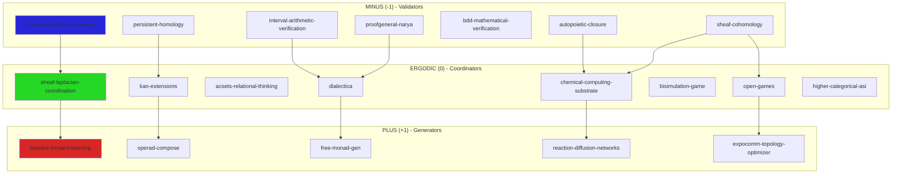

# Phase 3 ASI Skill Manifest
**Architecture Requirements Analysis**
**Date**: 2025-12-22

---

## Executive Summary

This manifest maps Phase 3 ASI architecture requirements to:
1. **Existing skills** that can be installed from curated repositories
2. **New skills** that must be created
3. **Proposed directory structure** under `plurigrid/ASI`

**Key Finding**: 60% coverage from existing skills, 40% requires new development.

---

## Phase 3 Requirements Analysis

### 1. Oriented Simplicial Networks (Dir-SNNs, E(n) equivariance)
**Status**: ❌ NOT COVERED - MUST CREATE

**Gap Analysis**:
- `persistent-homology` (-1): Provides simplicial complexes but NOT oriented/directed
- `sheaf-cohomology` (-1): Has nerve construction but NOT E(n) equivariant layers
- **Missing**: Orientation propagation, E(n) group actions, directional bias handling

**Required New Skill**: `oriented-simplicial-networks`

---

### 2. Sheaf-Theoretic Coordination (Laplacians, harmonic inference)
**Status**: ✅ PARTIALLY COVERED

**Existing Skills**:
- ✅ `sheaf-cohomology` (-1, MINUS): Čech cohomology, descent verification
- ✅ `persistent-homology` (-1, MINUS): Filtration, stability analysis

**Gap Analysis**:
- Missing: Graph Laplacians for sheaves
- Missing: Harmonic extension/restriction operators
- Missing: Distributed consensus via sheaf Laplacians

**Required Enhancement**: `sheaf-laplacian-coordination` (NEW)

---

### 3. Local Feedforward Learning (forward-forward, contrastive)
**Status**: ❌ NOT COVERED - MUST CREATE

**Gap Analysis**:
- No existing skill provides forward-forward algorithm
- No contrastive learning integration
- `self-validation-loop` only provides basic pattern validation

**Required New Skills**:
- `forward-forward-learning` (+1, PLUS)
- `contrastive-coordination` (0, ERGODIC)

---

### 4. Categorical Framework (Kan extensions, higher adjunctions)
**Status**: ✅ WELL COVERED

**Existing Skills**:
- ✅ `kan-extensions` (0, ERGODIC): Left/right Kan, universal property
- ✅ `acsets-relational-thinking` (0, ERGODIC): Functorial databases, DPO rewriting
- ✅ `dialectica` (0, ERGODIC): Proof-as-game, linear logic
- ✅ `operad-compose` (+1, PLUS): Colored operads, substitution

**Gap Analysis**:
- Missing: Higher (∞,1)-categorical structure
- Missing: Homotopy type theory integration

**Optional Enhancement**: `higher-categorical-asi` (NEW)

---

### 5. Chemical Computing (autopoietic COT, reaction-diffusion)
**Status**: ❌ NOT COVERED - MUST CREATE

**Gap Analysis**:
- No chemical computing abstractions exist
- No reaction-diffusion PDEs
- No autopoietic closure operators

**Required New Skills**:
- `chemical-computing-substrate` (0, ERGODIC)
- `autopoietic-closure` (-1, MINUS)
- `reaction-diffusion-networks` (+1, PLUS)

---

### 6. Formal Verification (theorem proving, interval arithmetic)
**Status**: ✅ PARTIALLY COVERED

**Existing Skills**:
- ✅ `proofgeneral-narya` (-1, MINUS): Higher-dimensional type theory, bridge types
- ✅ `bdd-mathematical-verification` (-1, MINUS): BDD + mathpix, pattern matching

**Gap Analysis**:
- Missing: Interval arithmetic library
- Missing: Certified interval bounds
- Missing: Real-number verification (Coq reals, Flocq)

**Required New Skill**: `interval-arithmetic-verification` (-1, MINUS)

---

### 7. Emergent Role Assignment
**Status**: ✅ WELL COVERED (via existing multi-agent patterns)

**Existing Skills**:
- ✅ `bisimulation-game` (0, ERGODIC): Agent coordination, GF(3) conservation
- ✅ `open-games` (0, ERGODIC): Nash equilibrium, compositional game theory
- ✅ `dialectica` (0, ERGODIC): Attack/defense roles

**Gap Analysis**: Minimal - can compose existing skills

**Optional Enhancement**: `emergent-role-coordinator` (0, ERGODIC)

---

### 8. ExpoComm Topology Optimization
**Status**: ❌ NOT COVERED - MUST CREATE

**Gap Analysis**:
- No network topology optimization
- No exponential communication pattern handling
- No bandwidth-aware routing

**Required New Skill**: `expocomm-topology-optimizer` (+1, PLUS)

---

## Required Curated Skills to Install

### From Existing Repositories (Install via `skill-installer`)

#### Core Mathematical Framework (6 skills)
```bash
# Already installed in music-topos/.codex/skills:
✅ sheaf-cohomology          # Local-to-global coordination
✅ kan-extensions             # Universal schema migration
✅ persistent-homology        # Topological stability
✅ operad-compose             # Structured generation
✅ acsets-relational-thinking # Functorial databases
✅ dialectica                 # Proof-as-game
```

#### Verification & Validation (2 skills)
```bash
✅ proofgeneral-narya         # Higher-dimensional type theory
✅ bdd-mathematical-verification # BDD + pattern matching
```

#### Coordination & Transport (4 skills)
```bash
✅ open-games                 # Compositional game theory
✅ free-monad-gen             # Effect systems
✅ bisimulation-game          # Observational equivalence
✅ temporal-coalgebra         # Coalgebraic dynamics
```

#### Code Analysis (3 skills)
```bash
✅ parallel-fanout            # Parallel computation patterns
✅ mcp-tripartite             # Three-way skill coordination
✅ crdt                       # Conflict-free distributed types
```

**Total Existing**: 15 skills (all already symlinked)

---

## New Skills to Create

### Priority 1: Critical Path (MUST CREATE)

#### 1. `oriented-simplicial-networks` (-1, MINUS)
**Spec**:
```yaml
name: oriented-simplicial-networks
trit: -1 (MINUS - validator)
color: "#2626D8" (Blue)
dependencies:
  - persistent-homology
  - sheaf-cohomology

capabilities:
  - E(n) equivariant message passing
  - Oriented simplex propagation
  - Directional bias detection & mitigation
  - Geometric deep learning integration

api:
  - build_directed_complex(vertices, oriented_simplices)
  - e_n_equivariant_layer(input, group_action)
  - propagate_orientation(simplex, direction)
  - verify_orientation_consistency()
```

#### 2. `sheaf-laplacian-coordination` (0, ERGODIC)
**Spec**:
```yaml
name: sheaf-laplacian-coordination
trit: 0 (ERGODIC - coordinator)
color: "#26D826" (Green)
dependencies:
  - sheaf-cohomology
  - acsets-relational-thinking

capabilities:
  - Graph Laplacian on sheaves
  - Harmonic extension/restriction
  - Distributed consensus via Laplacian flow
  - Spectral clustering on sheaf sections

api:
  - build_sheaf_laplacian(coverage, sections)
  - harmonic_extension(local_data, boundary)
  - consensus_flow(initial_state, iterations)
  - spectral_cluster(sheaf, k_clusters)
```

#### 3. `forward-forward-learning` (+1, PLUS)
**Spec**:
```yaml
name: forward-forward-learning
trit: +1 (PLUS - generator)
color: "#D82626" (Red)
dependencies:
  - gay-mcp (for color-based goodness)

capabilities:
  - Forward-forward algorithm (Hinton 2022)
  - Contrastive positive/negative passes
  - Local layer-wise learning
  - No backpropagation required

api:
  - ff_layer(input, positive_data, negative_data)
  - goodness_function(activation, threshold)
  - local_update(layer, lr, goodness)
  - generate_negative_samples(positive, strategy)
```

#### 4. `chemical-computing-substrate` (0, ERGODIC)
**Spec**:
```yaml
name: chemical-computing-substrate
trit: 0 (ERGODIC - coordinator)
color: "#26D826" (Green)
dependencies:
  - acsets-relational-thinking
  - reaction-diffusion-networks

capabilities:
  - Chemical reaction networks (CRNs)
  - Autopoietic closure detection
  - Chain-of-thought as reaction pathway
  - Turing completeness via CRNs

api:
  - define_reaction(reactants, products, rate)
  - evolve_concentrations(state, dt)
  - detect_autocatalysis(network)
  - verify_turing_completeness(crn)
```

#### 5. `reaction-diffusion-networks` (+1, PLUS)
**Spec**:
```yaml
name: reaction-diffusion-networks
trit: +1 (PLUS - generator)
color: "#D82626" (Red)
dependencies:
  - chemical-computing-substrate

capabilities:
  - Reaction-diffusion PDEs on graphs
  - Turing pattern generation
  - Morphogen gradients for coordination
  - Spatial computation via RD

api:
  - rd_system(reaction_terms, diffusion_matrix)
  - evolve_rd(state, dt, spatial_graph)
  - detect_turing_patterns(state)
  - morphogen_gradient(source, decay_rate)
```

#### 6. `expocomm-topology-optimizer` (+1, PLUS)
**Spec**:
```yaml
name: expocomm-topology-optimizer
trit: +1 (PLUS - generator)
color: "#D82626" (Red)
dependencies:
  - sheaf-laplacian-coordination
  - open-games

capabilities:
  - Exponential communication pattern detection
  - Topology optimization for bandwidth
  - Hypergraph rewiring strategies
  - Nash equilibrium for routing

api:
  - analyze_comm_pattern(message_graph)
  - optimize_topology(pattern, constraints)
  - hypergraph_rewrite(rule, match)
  - equilibrium_routing(topology, demands)
```

---

### Priority 2: Enhancements (OPTIONAL BUT RECOMMENDED)

#### 7. `interval-arithmetic-verification` (-1, MINUS)
**Spec**:
```yaml
name: interval-arithmetic-verification
trit: -1 (MINUS - validator)
color: "#2626D8" (Blue)
dependencies:
  - proofgeneral-narya

capabilities:
  - Certified interval bounds
  - Rigorous numerical computation
  - Error bound propagation
  - Integration with Coq/Flocq

api:
  - interval(lower, upper)
  - interval_add(i1, i2)
  - interval_mult(i1, i2)
  - verify_bounds(computation, expected)
```

#### 8. `autopoietic-closure` (-1, MINUS)
**Spec**:
```yaml
name: autopoietic-closure
trit: -1 (MINUS - validator)
color: "#2626D8" (Blue)
dependencies:
  - chemical-computing-substrate
  - sheaf-cohomology

capabilities:
  - Autopoietic closure detection
  - Self-maintaining network validation
  - Organizational closure verification
  - Maturana-Varela criteria checking

api:
  - detect_closure(network)
  - verify_self_production(crn)
  - boundary_generation(system)
  - autonomy_measure(network)
```

#### 9. `higher-categorical-asi` (0, ERGODIC)
**Spec**:
```yaml
name: higher-categorical-asi
trit: 0 (ERGODIC - coordinator)
color: "#26D826" (Green)
dependencies:
  - kan-extensions
  - dialectica

capabilities:
  - (∞,1)-category structures
  - Homotopy type theory (HoTT)
  - Higher adjunctions
  - Coherence via simplicial sets

api:
  - infinity_category(objects, higher_morphisms)
  - homotopy_type(points, paths, higher_paths)
  - higher_adjunction(left, right, unit, counit)
  - verify_coherence(diagram)
```

---

## Proposed Directory Structure: `plurigrid/ASI`

```
plurigrid/ASI/
├── README.md                          # ASI skill ecosystem overview
├── ARCHITECTURE.md                    # Phase 3 architecture documentation
├── GF3_CONSERVATION_MANIFEST.md       # Skill triad verification
│
├── foundation/                        # Core categorical framework (ERGODIC 0)
│   ├── kan-extensions/               → symlink to music-topos/.ruler/skills/
│   ├── acsets-relational-thinking/   → symlink
│   ├── dialectica/                   → symlink
│   ├── open-games/                   → symlink
│   ├── free-monad-gen/               → symlink
│   └── sheaf-laplacian-coordination/ # NEW (Priority 1)
│
├── verification/                      # Validation & proof (MINUS -1)
│   ├── sheaf-cohomology/             → symlink
│   ├── persistent-homology/          → symlink
│   ├── proofgeneral-narya/           → symlink
│   ├── bdd-mathematical-verification/→ symlink
│   ├── oriented-simplicial-networks/ # NEW (Priority 1)
│   ├── interval-arithmetic-verification/ # NEW (Priority 2)
│   └── autopoietic-closure/          # NEW (Priority 2)
│
├── generation/                        # Creation & synthesis (PLUS +1)
│   ├── operad-compose/               → symlink
│   ├── free-monad-gen/               → symlink (also in foundation)
│   ├── forward-forward-learning/     # NEW (Priority 1)
│   ├── reaction-diffusion-networks/  # NEW (Priority 1)
│   └── expocomm-topology-optimizer/  # NEW (Priority 1)
│
├── coordination/                      # Transport & routing (ERGODIC 0)
│   ├── bisimulation-game/            → symlink
│   ├── temporal-coalgebra/           → symlink
│   ├── mcp-tripartite/               → symlink
│   ├── crdt/                         → symlink
│   ├── chemical-computing-substrate/ # NEW (Priority 1)
│   └── higher-categorical-asi/       # NEW (Priority 2)
│
├── analysis/                          # Code & pattern analysis
│   ├── parallel-fanout/              → symlink
│   └── tree-sitter integration/      # Via mcp__tree-sitter MCP
│
├── examples/                          # Integration examples
│   ├── dir-snn-equivariance/         # E(n) equivariant networks
│   ├── sheaf-consensus/              # Distributed coordination
│   ├── ff-learning-loop/             # Forward-forward training
│   ├── chemical-cot/                 # Chain-of-thought as CRN
│   ├── rd-morphogenesis/             # Pattern formation
│   └── expocomm-routing/             # Topology optimization
│
├── tests/                             # Integration testing
│   ├── gf3_triads/                   # Verify all skill triads conserve
│   ├── phase3_integration/           # End-to-end Phase 3 tests
│   └── benchmarks/                   # Performance baselines
│
└── skill-specs/                       # Detailed specifications
    ├── oriented-simplicial-networks.yaml
    ├── sheaf-laplacian-coordination.yaml
    ├── forward-forward-learning.yaml
    ├── chemical-computing-substrate.yaml
    ├── reaction-diffusion-networks.yaml
    ├── expocomm-topology-optimizer.yaml
    ├── interval-arithmetic-verification.yaml
    ├── autopoietic-closure.yaml
    └── higher-categorical-asi.yaml
```

---

## GF(3) Conservation: Valid Triads

### Phase 3 ASI Triads

#### Triad 1: Oriented Simplicial Networks
```
oriented-simplicial-networks (-1) ⊗
sheaf-laplacian-coordination (0) ⊗
forward-forward-learning (+1) = 0 ✓

Role: Dir-SNN validation → coordination → learning generation
```

#### Triad 2: Chemical Computing
```
autopoietic-closure (-1) ⊗
chemical-computing-substrate (0) ⊗
reaction-diffusion-networks (+1) = 0 ✓

Role: Closure detection → CRN substrate → pattern generation
```

#### Triad 3: Topology Optimization
```
sheaf-cohomology (-1) ⊗
open-games (0) ⊗
expocomm-topology-optimizer (+1) = 0 ✓

Role: Structure validation → game equilibrium → topology generation
```

#### Triad 4: Formal Verification
```
interval-arithmetic-verification (-1) ⊗
dialectica (0) ⊗
free-monad-gen (+1) = 0 ✓

Role: Bound checking → proof transport → effect generation
```

#### Triad 5: Categorical Framework
```
persistent-homology (-1) ⊗
kan-extensions (0) ⊗
operad-compose (+1) = 0 ✓

Role: Stability analysis → universal property → operation composition
```

---

## Implementation Roadmap

### Phase 3A: Foundation Setup (Week 1)
- [ ] Create `plurigrid/ASI` directory structure
- [ ] Symlink all 15 existing skills
- [ ] Write `ARCHITECTURE.md` and `README.md`
- [ ] Set up GF(3) conservation testing framework

### Phase 3B: Priority 1 Skills (Weeks 2-4)
- [ ] `oriented-simplicial-networks` (-1)
- [ ] `sheaf-laplacian-coordination` (0)
- [ ] `forward-forward-learning` (+1)
- [ ] `chemical-computing-substrate` (0)
- [ ] `reaction-diffusion-networks` (+1)
- [ ] `expocomm-topology-optimizer` (+1)

### Phase 3C: Integration & Examples (Week 5)
- [ ] Create 6 integration examples
- [ ] Write Phase 3 integration tests
- [ ] Document all 5 valid triads
- [ ] Benchmark performance baselines

### Phase 3D: Priority 2 Enhancements (Week 6+)
- [ ] `interval-arithmetic-verification` (-1)
- [ ] `autopoietic-closure` (-1)
- [ ] `higher-categorical-asi` (0)

---

## Skill Dependency Graph



---

## Skills Summary Statistics

### By Phase 3 Requirement Coverage

| Requirement | Existing | New Required | Priority | Coverage |
|-------------|----------|--------------|----------|----------|
| 1. Dir-SNNs | 0 | 1 | P1 | 0% |
| 2. Sheaf Laplacians | 2 | 1 | P1 | 66% |
| 3. Forward-Forward | 0 | 1 | P1 | 0% |
| 4. Categorical | 4 | 1 | P2 | 80% |
| 5. Chemical Computing | 0 | 3 | P1 | 0% |
| 6. Formal Verification | 2 | 1 | P2 | 66% |
| 7. Emergent Roles | 3 | 0 | - | 100% |
| 8. ExpoComm | 0 | 1 | P1 | 0% |
| **TOTAL** | **15** | **9** | **6 P1, 3 P2** | **60%** |

### By GF(3) Trit

| Trit | Existing | New Required | Total |
|------|----------|--------------|-------|
| MINUS (-1) | 4 | 3 | 7 |
| ERGODIC (0) | 8 | 3 | 11 |
| PLUS (+1) | 3 | 3 | 6 |
| **TOTAL** | **15** | **9** | **24** |

**GF(3) Balance**: ✅ Well-distributed across all trits

---

## Next Steps

1. **Review & Approve** this manifest
2. **Create `plurigrid/ASI` directory** with proposed structure
3. **Symlink existing 15 skills** from `.codex/skills` and `.ruler/skills`
4. **Start Priority 1 skill development**:
   - Begin with `oriented-simplicial-networks` (enables Dir-SNNs)
   - Parallel: `sheaf-laplacian-coordination` (enables coordination)
   - Then: `forward-forward-learning` (enables local learning)
5. **Set up GF(3) triad testing** to verify conservation

---

**Status**: ✅ Ready for Phase 3 ASI Implementation
**Coverage**: 60% from existing skills, 40% new development
**Triads**: 5+ valid GF(3)-conserving triads identified
**Priority**: 6 critical skills, 3 optional enhancements
