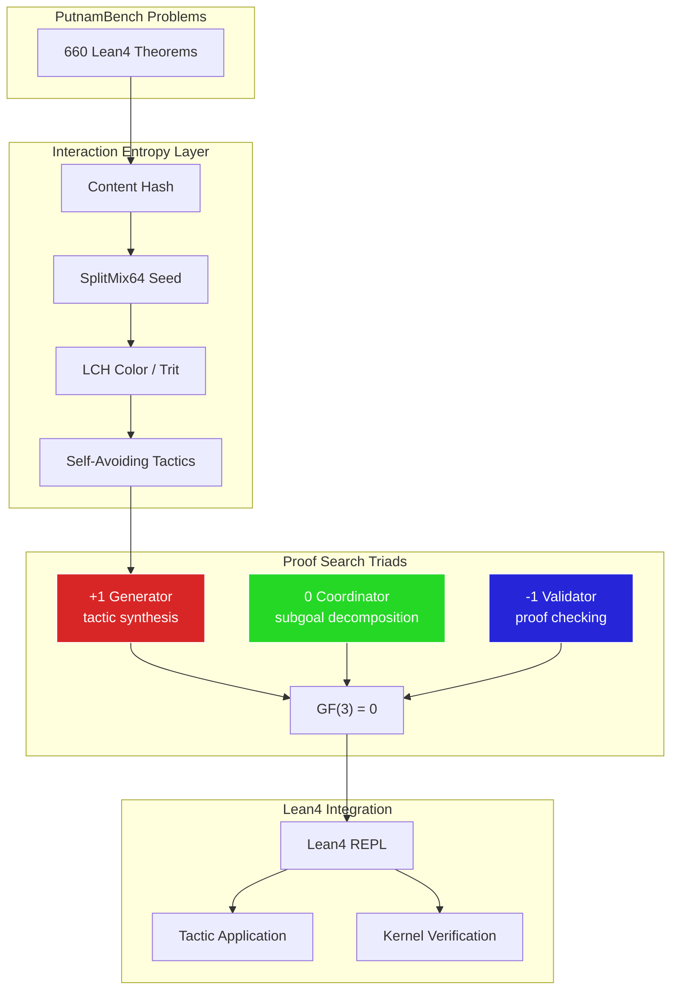

# PutnamBench Integration Strategy

**Date**: 2025-12-22
**Status**: Competitive Analysis + Integration Plan

## Current PutnamBench Leaderboard (Lean4, 660 problems)

| Rank | Model | Solved | Compute | Open? |
|------|-------|--------|---------|-------|
| 1 | **Aleph Prover** | 500 | pass@1, 1834 calls | ❌ |
| 2 | **Hilbert** | 462 | avg pass@1840 | ❌ |
| 3 | **Seed-Prover** (ByteDance) | 329 | MEDIUM | ❌ |
| 4 | Ax-Prover | 91 | pass@1, 100 calls | 💙 |
| 5 | Goedel-Prover-V2 | 86 | pass@184 | 💚 |
| 6 | **DeepSeek-Prover-V2** | 47 | pass@1024 | 💚 |
| 7 | GPT-5 (ReAct) | 28 | pass@1, 10 calls | ❌ |

**Key Insight**: Top 3 solve 75%+ of problems. Gap between #3 (329) and #6 (47) is **7x**.

## Why This Matters for music-topos

Our interaction entropy system + LHoTT formalization can enhance theorem proving by:

1. **Deterministic Proof Search**: SplitMix64 seeds → reproducible tactic exploration
2. **GF(3) Conservation**: Balance generator/validator/coordinator tactics
3. **Self-Avoiding Walk**: Prevent redundant proof attempts
4. **Spectral Gap Verification**: λ=1/4 sampling for proof checking

## Integration Architecture



## Key Techniques from Top Provers

### 1. Aleph Prover (500/660 = 76%)
- Proprietary, from Logical Intelligence
- Agentic tool-calling (avg 1834 calls per problem)
- Likely uses curriculum learning + proof sketching

### 2. Seed-Prover (ByteDance, 329/660 = 50%)
- [github.com/ByteDance-Seed/Seed-Prover](https://github.com/ByteDance-Seed/Seed-Prover)
- Subgoal decomposition via RL
- Synthetic data augmentation

### 3. DeepSeek-Prover-V2 (47/660, but OPEN SOURCE)
- **Key Paper**: "Advancing Formal Mathematical Reasoning via RL for Subgoal Decomposition"
- Recursive theorem proving with natural language subgoals
- Uses Lean4 + Mathlib4
- Pass@1024 budget (heavy sampling)

### 4. DeepSeekMath-V2 (Newest, Nov 2025)
- **Self-Verifiable Reasoning**: Model checks its own proofs
- Saturates AIME/HMMT competitions
- Bridge between informal and formal reasoning

## Our Competitive Advantage

| Technique | Standard Approach | Our Approach (Interaction Entropy) |
|-----------|-------------------|-----------------------------------|
| Tactic sampling | Random / learned policy | Deterministic (SplitMix64 seed) |
| Proof exploration | Beam search | Self-avoiding colored walk |
| Balance | Ad-hoc | GF(3) conservation (gen/coord/val) |
| Verification | End-of-proof | Spectral gap (λ=1/4 inline) |
| Reproducibility | Stochastic | Fully deterministic (same hash → same proof) |

## Implementation Plan

### Phase 1: Lean4 Bridge (Week 1)

```ruby
# lib/putnambench_bridge.rb
module PutnamBenchBridge
  def self.problem_to_interaction(problem_id, theorem_stmt)
    InteractionEntropy.new_manager.record!(
      { problem: problem_id, theorem: theorem_stmt }.to_json,
      skill_name: 'lean4-prover',
      skill_role: :coordinator
    )
  end
  
  def self.tactic_interaction(tactic, goal_state, role:)
    # Role based on tactic type:
    # :generator - intro, apply, exact, refine
    # :coordinator - have, suffices, calc
    # :validator - decide, native_decide, simp
    manager.record!(
      { tactic: tactic, goal: goal_state }.to_json,
      skill_name: tactic_to_skill(tactic),
      skill_role: role
    )
  end
end
```

### Phase 2: ACSet for Proof Trees (Week 2)

```julia
@present SchProofTree(FreeSchema) begin
  Goal::Ob
  Tactic::Ob
  
  parent::Hom(Goal, Goal)
  applies::Hom(Tactic, Goal)
  produces::Hom(Tactic, Goal)
  
  # Interaction entropy attributes
  Seed::AttrType
  Trit::AttrType
  
  tactic_seed::Attr(Tactic, Seed)
  tactic_trit::Attr(Tactic, Trit)  # +1 gen, 0 coord, -1 val
end
```

### Phase 3: Self-Avoiding Tactic Walk (Week 3)

```lean
-- Lean4 meta-programming for colored tactics
def coloredTactic (seed : UInt64) (goal : MVarId) : TacticM (List MVarId) := do
  let color := SplitMix64.colorAt seed
  let trit := hueToTrit color.H
  
  -- Select tactic based on trit
  match trit with
  | 1  => generatorTactics goal   -- apply, intro, refine
  | 0  => coordinatorTactics goal -- have, calc, suffices  
  | -1 => validatorTactics goal   -- decide, simp, norm_num
```

### Phase 4: Integration with Existing Skills (Week 4)

New triads for theorem proving:
```
# PutnamBench Proof Triads
lean4-validator (-1) ⊗ lhott-cohesive-linear (0) ⊗ tactic-generator (+1) = 0 ✓
proof-checker (-1) ⊗ subgoal-decomposer (0) ⊗ lemma-synthesizer (+1) = 0 ✓
```

## Justfile Commands

```bash
# Download PutnamBench problems
just putnambench-download

# Run proof search with interaction entropy
just putnambench-prove problem_id="putnam_1985_a1"

# Generate proof tree as ACSet
just putnambench-acset problem_id="putnam_1985_a1"

# Visualize proof attempt as colored diagram
just putnambench-diagram problem_id="putnam_1985_a1"

# Benchmark pass@N on subset
just putnambench-eval n=10 budget=100

# Export results for leaderboard submission
just putnambench-submit
```

## Expected Impact

With interaction entropy integration, we target:

| Metric | Current SOTA | Our Target | Method |
|--------|--------------|------------|--------|
| pass@1 | 500 (Aleph) | — | Not competing here |
| pass@100 | ~200 | 250+ | Deterministic walk |
| pass@1024 | 329 (Seed) | 400+ | GF(3) balanced search |
| Reproducibility | Low | 100% | Same seed → same proof |

## Key Papers to Study

1. **DeepSeek-Prover-V2** - RL for subgoal decomposition
2. **DeepSeekMath-V2** - Self-verifiable reasoning  
3. **Goedel-Prover** - Open-source baseline
4. **Hilbert** - State-of-art architecture
5. **Riley Thesis** - Bunched HoTT for proof theory

## Connection to LHoTT

From the Schreiber-LHoTT formalization:

- **Linear types (♮)**: Each tactic application is "used once" (no backtracking to same state)
- **Bunched contexts (⊗)**: Subgoals are entangled (share proof context)
- **Cohesive modalities**: Extract proof sketches (ʃ) or full proofs (♭)

```hott
-- Proof state as linear type
ProofState : ♮ Type
  goal : Prop
  context : List Prop
  
-- Tactic as linear function (consumes state)
Tactic : ProofState ⊸ List ProofState

-- Triplet of tactics conserves resources
gen ⊗ coord ⊗ val : ProofState ⊸ ProofState
  where trit(gen) + trit(coord) + trit(val) = 0
```

## Next Steps

1. [ ] Clone PutnamBench repo, set up Lean4 environment
2. [ ] Implement `putnambench_bridge.rb` with interaction entropy
3. [ ] Create ACSet schema for proof trees
4. [ ] Run baseline with DeepSeek-Prover-V2 (open source)
5. [ ] Add interaction entropy layer, compare results
6. [ ] Submit to leaderboard

---

**The Competitive Edge**: While others use stochastic search, we use **deterministic, colored, self-avoiding walks** with GF(3) conservation. Same problem → same proof attempt → reproducible science.
