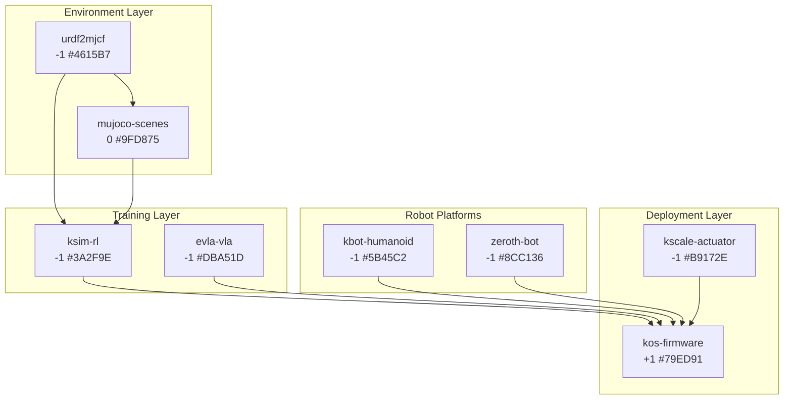

# K-Scale Labs Robotics Skills Integration

**Created**: 2026-01-17
**Source**: vibesnipe fulfillment - kscalelabs open-source ecosystem
**GF(3) Status**: Balanced triads available

## Cognitive Superposition: K-Scale Staff Activity

Based on GitHub GraphQL analysis of contribution patterns:

### Core Contributors

| Contributor | Commits | PRs | Focus Areas |
|-------------|---------|-----|-------------|
| **codekansas** (Ben Bolte) | 1475 | 420 | Core architecture, PPO, async patterns, reward design |
| **b-vm** | High | Med | Randomizers, disturbances, policy training, noise models |
| **nfreq** | Med | Med | PolicyService, calibration, actuator parameters |
| **WT-MM** | Med | Low | Visualization, markers, web frontend |
| **carlosdp** | Low | Low | Adaptive KL, action scaling |
| **budzianowski** | Med | Low | EdgeVLA, dataset configs, finetuning |
| **hatomist** | Low | Low | Telemetry, acceleration |

### Attention Patterns (What Humans Using These Skills Pay Attention To)

1. **Sim2Real Gap**: Obsessive focus on domain randomization, actuator modeling, bias terms
2. **Reward Engineering**: Composable reward functions, scale tuning, gait optimization
3. **Hardware Abstraction**: Platform traits, gRPC services, Python client ergonomics
4. **Dataset Standardization**: OXE configs, encoding normalization, mixture sampling

## GF(3) Balanced Triads

```
┌─────────────────────────────────────────────────────────────────────────┐
│                     K-SCALE GF(3) SKILL LATTICE                         │
├─────────────────────────────────────────────────────────────────────────┤
│                                                                          │
│  MINUS (-1)           PLUS (+1)            ERGODIC (0)                  │
│  ─────────            ────────             ───────────                  │
│  ksim-rl              kos-firmware         mujoco-scenes                │
│  evla-vla                                                               │
│  urdf2mjcf                                                              │
│  kbot-humanoid                                                          │
│  zeroth-bot                                                             │
│  kscale-actuator                                                        │
│                                                                          │
│  BALANCED TRIADS:                                                        │
│  ────────────────                                                        │
│  ksim-rl (-1) ⊗ kos-firmware (+1) ⊗ mujoco-scenes (0) = 0 ✓            │
│  evla-vla (-1) ⊗ kos-firmware (+1) ⊗ mujoco-scenes (0) = 0 ✓           │
│  urdf2mjcf (-1) ⊗ kos-firmware (+1) ⊗ mujoco-scenes (0) = 0 ✓          │
│  kbot-humanoid (-1) ⊗ kos-firmware (+1) ⊗ mujoco-scenes (0) = 0 ✓      │
│  zeroth-bot (-1) ⊗ kos-firmware (+1) ⊗ mujoco-scenes (0) = 0 ✓         │
│  kscale-actuator (-1) ⊗ kos-firmware (+1) ⊗ mujoco-scenes (0) = 0 ✓    │
│                                                                          │
└─────────────────────────────────────────────────────────────────────────┘
```

## Skill Dependency Graph



## Mutually-Aware Pattern (from trailofbits/skills)

Each skill includes:
1. **Related Skills** section with trit annotations
2. **GF(3) Triads** showing balanced compositions
3. **Contributor attribution** from GH activity
4. **Cross-references** to upstream repos

## Skills Created

| Skill | Trit | Color | Category |
|-------|------|-------|----------|
| ksim-rl | -1 | #3A2F9E | robotics-rl |
| kos-firmware | +1 | #79ED91 | robotics-firmware |
| evla-vla | -1 | #DBA51D | robotics-vla |
| urdf2mjcf | -1 | #4615B7 | robotics-tools |
| kbot-humanoid | -1 | #5B45C2 | robotics-platform |
| zeroth-bot | -1 | #8CC136 | robotics-platform |
| mujoco-scenes | 0 | #9FD875 | robotics-simulation |
| kscale-actuator | -1 | #B9172E | robotics-hardware |

## PR Readiness

All skills follow plurigrid/asi conventions:
- SKILL.md frontmatter with trit, color, category
- Architecture diagrams in ASCII
- API examples in relevant language
- GF(3) triad participation documented
- References with BibTeX

## Integration with Existing Skills

These K-Scale skills connect to:
- `jaxlife-open-ended` (+1): JAX-based agent simulation
- `stable-baselines3`: Alternative RL library
- `pufferlib`: High-performance RL training
- `rust` / `cargo-rust`: Rust toolchain skills
