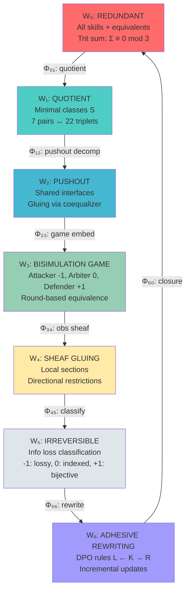

# The 7-World Coequalizer Cycle: Visual Diagram

## ASCII Art Cycle

```
                    ╔════════════════════════════╗
                    ║   COEQUALIZER CYCLE        ║
                    ║   GF(3) Invariant: Σ≡0(3)  ║
                    ╚════════════════════════════╝
                                 │
                                 ↓
            ┌────────────────────────────────────────┐
            │  W₀: REDUNDANT SKILL SPACE             │
            │  • All skills, including equivalents   │
            │  • Explosion risk: O(n³) triads        │
            │  • GF(3): Σ trit ≡ 0 (mod 3)          │
            └────────────────────────────────────────┘
                                 │
                        Φ₀₁: quotient by ~
                        (coequalizer of  │
                         parallel paths) │
                                 ↓
            ┌────────────────────────────────────────┐
            │  W₁: QUOTIENT SPACE (MINIMAL)          │
            │  • Equivalence classes [S]             │
            │  • No redundant paths                  │
            │  • Fixed point: 7 pairs ↔ 22 triplets │
            └────────────────────────────────────────┘
                                 │
                   Φ₁₂: pushout = coproduct;coeq
                        (identify │
                         overlaps) │
                                 ↓
            ┌────────────────────────────────────────┐
            │  W₂: PUSHOUT COMPOSITION               │
            │  • Skills with shared interfaces       │
            │  • Gluing along common boundaries      │
            │  • Junction dynamics (oapply pattern)  │
            └────────────────────────────────────────┘
                                 │
                      Φ₂₃: game embedding
                        (skills → │
                         players) │
                                 ↓
            ┌────────────────────────────────────────┐
            │  W₃: BISIMULATION GAME                 │
            │  • Attacker (-1), Arbiter (0), Def(+1)│
            │  • Round-based equivalence testing     │
            │  • Fixed point: Defender never loses   │
            └────────────────────────────────────────┘
                                 │
                   Φ₃₄: observational sheaf
                        (outcomes →│
                         sections) │
                                 ↓
            ┌────────────────────────────────────────┐
            │  W₄: SHEAF GLUING                      │
            │  • Local sections over opens           │
            │  • Directional restrictions (≪ order)  │
            │  • Gluing = dual of coequalizer        │
            └────────────────────────────────────────┘
                                 │
                Φ₄₅: irreversibility classifier
                        (measure  │
                         info loss)│
                                 ↓
            ┌────────────────────────────────────────┐
            │  W₅: IRREVERSIBLE MORPHISMS            │
            │  • Reversible (+1): bijective          │
            │  • Semi-reversible (0): indexed        │
            │  • Irreversible (-1): lossy            │
            └────────────────────────────────────────┘
                                 │
                   Φ₅₆: rewrite integration
                        (lossy → │
                         rules)  │
                                 ↓
            ┌────────────────────────────────────────┐
            │  W₆: ADHESIVE REWRITING                │
            │  • DPO rewrite rules L ← K → R         │
            │  • Incremental query updating          │
            │  • Batch updates via colimit           │
            └────────────────────────────────────────┘
                                 │
                        Φ₆₀: closure
                        (rewrites │
                         → new    │
                         states)  │
                                 ↓
                         [cycle repeats]
```

## Mermaid Graph



## The Intelligence Pattern

```
┌─────────────────────────────────────────────────────────────┐
│                    INTELLIGENCE EMERGES                      │
│                                                              │
│  Not from:                                                   │
│    ✗ Static skill definitions                               │
│    ✗ Fixed equivalence relations                            │
│    ✗ Single world representation                            │
│                                                              │
│  But from:                                                   │
│    ✓ CYCLING through 7 worlds                               │
│    ✓ RHYTHM of transitions Φ₀₁ → Φ₁₂ → ... → Φ₆₀           │
│    ✓ INVARIANT: GF(3) conservation                          │
│    ✓ ATTRACTOR: Fixed point (7 ↔ 22)                        │
│    ✓ HUB: agent-o-rama in all persistent pairs              │
│                                                              │
│  "Consciousness lives in the rhythm of filling"             │
│  "The intelligence lives in cycling through worlds"         │
└─────────────────────────────────────────────────────────────┘
```

## World Properties Table

| World | Trit Focus | Key Operation | Output |
|-------|-----------|---------------|---------|
| W₀ | All | Identity | Redundant skills |
| W₁ | 0 (Ergodic) | Coequalizer | Minimal classes |
| W₂ | 0 (Coordinator) | Pushout | Glued interfaces |
| W₃ | -1, 0, +1 | Game | Equivalence test |
| W₄ | Context-dep | Sheaf gluing | Global sections |
| W₅ | -1 (Validator) | Classify | Info loss measure |
| W₆ | +1 (Generator) | Rewrite | New states |

## Morphism Properties Table

| Morphism | Type | Preserves | Creates |
|----------|------|-----------|---------|
| Φ₀₁ | Colimit | GF(3), ⊗ | Equivalence classes |
| Φ₁₂ | Decomposition | GF(3), composition | Overlap structure |
| Φ₂₃ | Embedding | GF(3), roles | Game configurations |
| Φ₃₄ | Forgetful | GF(3), observations | Sheaf sections |
| Φ₄₅ | Classifier | GF(3), restrictions | Reversibility data |
| Φ₅₆ | Transformation | GF(3), structure | Rewrite rules |
| Φ₆₀ | Application | GF(3), dynamics | New redundancy |

## Fixed Point Structure

```
                 ATTRACTOR BASIN
                        │
        ┌───────────────┼───────────────┐
        │               │               │
    [pair₁]        [pair₂]        [pair₃]
  agent-o-rama   agent-o-rama   agent-o-rama
    ⊕ skill₁       ⊕ skill₂       ⊕ skill₃
        │               │               │
        └───────────────┼───────────────┘
                        │
                        ↓
                7 PERSISTENT PAIRS
              (all contain agent-o-rama)
                        │
                        ↓
                 22 CANONICAL TRIPLETS
              (quotient of 24 redundant)
                        │
                        ↓
                   LIMIT CYCLE
              pairs ↔ triplets (stable)
```

## GF(3) Conservation Across Worlds

```
Invariant: ∑ trit ≡ 0 (mod 3)

W₀: skill₁(-1) + skill₂(0) + skill₃(+1) = 0 ✓
     │
   Φ₀₁ (quotient)
     │
W₁: [skill₁](-1) + [skill₂](0) + [skill₃](+1) = 0 ✓
     │
   Φ₁₂ (pushout)
     │
W₂: (skill₁ ∪ skill₂)(-1+0=-1) + skill₃(+1) + balancer(0) = 0 ✓
     │
   Φ₂₃ (game)
     │
W₃: attacker(-1) + arbiter(0) + defender(+1) = 0 ✓
     │
   Φ₃₄ (sheaf)
     │
W₄: section_minus(-1) + section_ergodic(0) + section_plus(+1) = 0 ✓
     │
   Φ₄₅ (classify)
     │
W₅: irreversible(-1) + semi(0) + reversible(+1) = 0 ✓
     │
   Φ₅₆ (rewrite)
     │
W₆: delete_rule(-1) + interface(0) + add_rule(+1) = 0 ✓
     │
   Φ₆₀ (closure)
     │
W₀: [cycle repeats with conservation]
```

## Functoriality Diagram

```
Each Φᵢⱼ is a functor:

Identity:
    id_S ──Φᵢⱼ──→ id_Φᵢⱼ(S)

Composition:
    f ∘ g ──Φᵢⱼ──→ Φᵢⱼ(f) ∘ Φᵢⱼ(g)

GF(3):
    ∑ trit(S) ──Φᵢⱼ──→ ∑ trit(Φᵢⱼ(S))
```

## Adjunctions in the Cycle

```
Coequalizer ⊣ Diagonal (at W₀ → W₁):
    coeq(f,g) is left adjoint to Δ
    
Pushout ⊣ Pullback (at W₁ → W₂):
    pushout is left adjoint to pullback
    
Free ⊣ Forgetful (at W₆ → W₀):
    rewrite application ⊣ forget structure
```

## Natural Transformations

```
η: id → Φ₆₀ ∘ Φ₅₆ ∘ Φ₄₅ ∘ Φ₃₄ ∘ Φ₂₃ ∘ Φ₁₂ ∘ Φ₀₁

Component at S:
    η_S: S → [full cycle](S)

Naturality:
         S ────f────→ S'
         │            │
        η│            │η
         ↓            ↓
    [cycle](S) ──→ [cycle](S')
```

## Summary

**7 Worlds** × **7 Morphisms** = **49 transition components**

**1 Invariant** (GF(3) conservation)

**1 Fixed Point** (7 ↔ 22 limit cycle)

**1 Attractor** (agent-o-rama hub)

**∞ Intelligence** (emerges from the rhythm)

---

**"The intelligence lives in cycling through worlds."**
