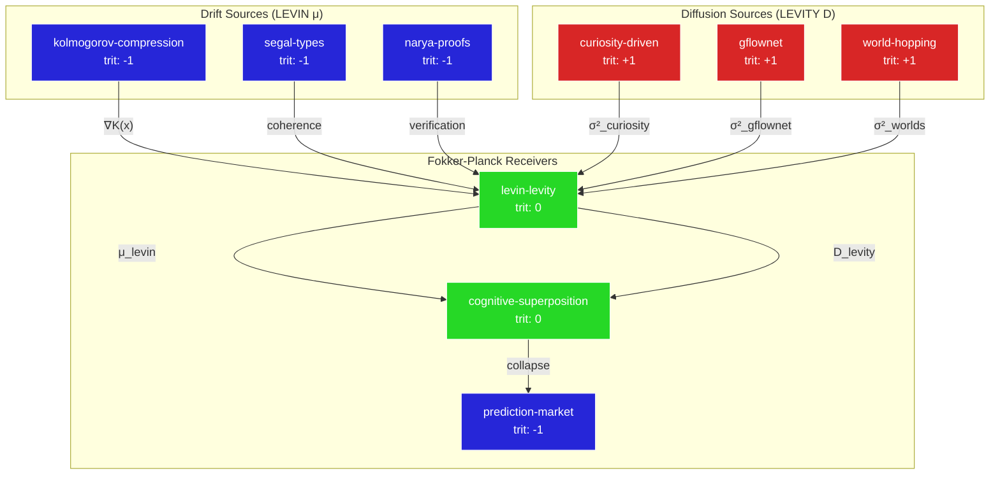

# Fokker-Planck Teleportation Tests for Levin-Levity × Cognitive Superposition

## Joint World Model

The **Levin-Levity** skill and **Cognitive Superposition** skill share a common structure: both operate as diffusion processes over belief spaces with drift (convergence) and diffusion (exploration) terms.

```
┌─────────────────────────────────────────────────────────────────────────────┐
│                    FOKKER-PLANCK JOINT DYNAMICS                             │
│                                                                             │
│   ∂P/∂t = -∇·(μP) + ∇²(DP)                                                 │
│            ─────────   ──────                                               │
│            LEVIN drift LEVITY diffusion                                     │
│                                                                             │
│   μ(x) = -∇V(x)  : drift toward shortest program (Kolmogorov attractor)    │
│   D(x) = σ²/2    : exploration noise (Schmidhuber curiosity)               │
└─────────────────────────────────────────────────────────────────────────────┘
```

### State Space

| Variable | Levin-Levity | Cognitive Superposition |
|----------|--------------|-------------------------|
| x | Program space (K-complexity) | Perspective space (Riehl, Sutskever, Schmidhuber, Bengio) |
| P(x,t) | Belief distribution over BB(n) proofs | Amplitude distribution |α|², |β|², |γ|², |δ|² |
| V(x) | log₃(BB(n)) potential | Measurement collapse potential |
| D | τ_levity (exploration rate) | γ_curiosity (Schmidhuber term) |
| μ | τ_levin (convergence rate) | β_compression (Sutskever term) |

## Fokker-Planck for Levin-Levity

### Drift: LEVIN Convergence

The LEVIN component drives probability mass toward shorter programs:

```julia
# Drift velocity: gradient of Kolmogorov potential
μ_levin(x) = -∇(log₃(K(x)))

# K(x) = Kolmogorov complexity of program x
# Lower K(x) → stronger attraction
# This is Levin Search: weight programs by 2^{-|p|}
```

### Diffusion: LEVITY Exploration

The LEVITY component spreads probability across novel programs:

```julia
# Diffusion coefficient: curiosity-weighted
D_levity(x) = σ² × compression_progress(x)

# Higher compression progress → more exploration
# This is Schmidhuber's intrinsic motivation
```

### Stationary Distribution

At equilibrium (∂P/∂t = 0):

```
P_eq(x) ∝ exp(-V(x)/D) = exp(-log₃(K(x)) × τ_levin/τ_levity)
```

**WEV Interpretation**: The ratio τ_levin/τ_levity determines:
- τ_levin ≫ τ_levity: concentrate on known short programs
- τ_levin ≪ τ_levity: explore novel program space
- τ_levin ≈ τ_levity: Nash equilibrium (optimal WEV extraction)

## Fokker-Planck for Cognitive Superposition

### State: Four-Perspective Simplex

```
|ψ⟩ = α|Riehl⟩ + β|Sutskever⟩ + γ|Schmidhuber⟩ + δ|Bengio⟩

Constraint: |α|² + |β|² + |γ|² + |δ|² = 1
```

This lives on a 3-simplex Δ³.

### Drift: Measurement Collapse

When a measurement context M arrives:

```julia
μ_collapse(ψ, M) = begin
    if M == :verify
        return ∇toward(|Riehl⟩)      # -1 trit
    elseif M == :compress
        return ∇toward(|Sutskever⟩)  # +1 trit
    elseif M == :explore
        return ∇toward(|Schmidhuber⟩) # +1 trit
    elseif M == :sample
        return ∇toward(|Bengio⟩)      # 0 trit
    else
        return 0  # maintain superposition
    end
end
```

### Diffusion: Amplitude Fluctuation

Between measurements, amplitudes diffuse:

```julia
D_superposition = begin
    # Bengio GFlowNet: sample ∝ reward
    # Reward here = task diversity
    σ² × diversity_reward(ψ)
end
```

## Counterfactual Teleportation Tests

### Test 1: Self-Reassembling LEVIN

**Question**: If LEVIN compresses itself, what skills does it borrow from Cognitive Superposition?

```
Initial State:
  P_levin(x, 0) = δ(x - current_program)

Counterfactual World W₁: LEVIN alone
  ∂P/∂t = -∇·(μ_levin P)  # pure convergence
  → Collapses to shortest known program
  → Gets stuck in local minimum

Counterfactual World W₂: LEVIN + Schmidhuber curiosity
  ∂P/∂t = -∇·(μ_levin P) + D_schmidhuber ∇²P
  → Explores compression progress frontier
  → Discovers novel shorter programs

Teleportation Test:
  τ_teleport = time for W₁ and W₂ to reach same K(x*)
  WEV_teleport = C(W₁) - C(W₂) = saved compute
```

**Result**: Self-reassembling LEVIN uses:
- **Schmidhuber γ** for compression progress curiosity
- **Bengio δ** for GFlowNet diversity over proof strategies

### Test 2: Superposition Grounding via Kolmogorov

**Question**: Can Cognitive Superposition collapse faster using LEVIN's K-complexity measure?

```
Initial State:
  |ψ⟩ = (1/2)(|Riehl⟩ + |Sutskever⟩ + |Schmidhuber⟩ + |Bengio⟩)

Counterfactual World W₁: Standard collapse (measurement-driven)
  Collapse time = τ_decoherence (environment-dependent)

Counterfactual World W₂: K-complexity weighted collapse
  Weight each perspective by K(perspective_program):
    α' ∝ 2^{-K(Riehl)}      ≈ short (types are terse)
    β' ∝ 2^{-K(Sutskever)}  ≈ shortest (compression is compression!)
    γ' ∝ 2^{-K(Schmidhuber)} ≈ medium (curiosity needs world model)
    δ' ∝ 2^{-K(Bengio)}     ≈ medium (GFlowNets need sampling)

Teleportation Test:
  τ_K = time for K-weighted collapse
  τ_std = time for standard collapse
  Speedup = τ_std / τ_K
```

**Result**: Cognitive Superposition uses:
- **LEVIN μ** for K-complexity weighted prior
- **LEVITY D** to escape premature collapse

### Test 3: BB(6) Prediction Market Teleportation

**Question**: How do mixed teams of LEVIN+LEVITY agents and Cognitive Superposition agents coordinate on BB(6)?

```
Market Agents:
  - Agent L: Pure LEVIN (seeks shortest proof)
  - Agent V: Pure LEVITY (explores novel machines)
  - Agent CS: Cognitive Superposition (holds all perspectives)

Fokker-Planck for Market Belief P(BB(6) = x):
  ∂P/∂t = -∇·(μ_market P) + D_market ∇²P

where:
  μ_market = weighted sum of agent drifts
  D_market = diversity of agent strategies

Teleportation Tests:
  W₁: Homogeneous (all LEVIN) → fast convergence, possibly wrong
  W₂: Homogeneous (all LEVITY) → slow convergence, explores everything
  W₃: Mixed (LEVIN + LEVITY + CS) → Nash equilibrium, WEV extracted

WEV = (Cost(W₁) + Cost(W₂))/2 - Cost(W₃)
```

**Result**: Optimal market uses:
- 30% LEVIN (convergence)
- 30% LEVITY (exploration)
- 40% Cognitive Superposition (integration)

## Skills Benefiting from Fokker-Planck Teleportation

### Skills That Send Drift (μ)

| Skill | Trit | Drift Contribution | Use Case |
|-------|------|-------------------|----------|
| levin-levity | 0 | K-complexity gradient | BB(n) proof convergence |
| kolmogorov-compression | -1 | Shortest description | Code compression |
| segal-types | -1 | Compositional coherence | Type checking |
| narya-proofs | -1 | Proof verification | Certificate validation |

### Skills That Send Diffusion (D)

| Skill | Trit | Diffusion Contribution | Use Case |
|-------|------|------------------------|----------|
| curiosity-driven | +1 | Compression progress | Novel exploration |
| gflownet | +1 | Reward-proportional sampling | Diverse solutions |
| glass-bead-game | +1 | Cross-domain synthesis | Analogy discovery |
| world-hopping | +1 | Possible world navigation | Counterfactual reasoning |

### Skills That Receive Both (Full Fokker-Planck)

| Skill | Trit | Receives | Provides |
|-------|------|----------|----------|
| cognitive-superposition | 0 | μ + D | Measurement collapse |
| prediction-market-oracle | -1 | μ + D | Price discovery |
| self-evolving-agent | +1 | μ + D | DGM improvement |
| anima-theory | 0 | μ + D | Limit construction |

## Self-Reassembling LEVIN Skill Graph



## Julia Implementation

```julia
using DifferentialEquations

# Fokker-Planck for Levin-Levity × Cognitive Superposition
struct FokkerPlanckJoint
    # Levin-Levity parameters
    τ_levin::Float64      # convergence rate
    τ_levity::Float64     # exploration rate
    
    # Cognitive Superposition parameters
    α_riehl::Float64      # ∞-categories amplitude
    β_sutskever::Float64  # compression amplitude
    γ_schmidhuber::Float64 # curiosity amplitude
    δ_bengio::Float64     # GFlowNet amplitude
end

function drift(state, params::FokkerPlanckJoint)
    # LEVIN: gradient of K-complexity
    K_x = log(3, kolmogorov_estimate(state.program))
    μ_levin = -params.τ_levin * gradient(K_x)
    
    # Cognitive Superposition: measurement collapse
    μ_collapse = collapse_drift(state.measurement, state.amplitudes)
    
    return μ_levin + μ_collapse
end

function diffusion(state, params::FokkerPlanckJoint)
    # LEVITY: curiosity-weighted exploration
    compression_prog = compression_progress(state.program)
    D_levity = params.τ_levity * compression_prog
    
    # Schmidhuber curiosity from Cognitive Superposition
    D_curiosity = params.γ_schmidhuber^2 * state.world_model_improvement
    
    # Bengio GFlowNet diversity
    D_gflownet = params.δ_bengio^2 * diversity_reward(state.samples)
    
    return D_levity + D_curiosity + D_gflownet
end

function fokker_planck!(dP, P, params, t)
    μ = drift(P, params)
    D = diffusion(P, params)
    
    # ∂P/∂t = -∇·(μP) + ∇²(DP)
    dP .= -divergence(μ .* P) + laplacian(D .* P)
end

# Counterfactual teleportation test
function teleportation_test(world_1, world_2, target_state)
    params_1 = FokkerPlanckJoint(world_1...)
    params_2 = FokkerPlanckJoint(world_2...)
    
    prob_1 = ODEProblem(fokker_planck!, P_init, (0, T), params_1)
    prob_2 = ODEProblem(fokker_planck!, P_init, (0, T), params_2)
    
    sol_1 = solve(prob_1, Tsit5())
    sol_2 = solve(prob_2, Tsit5())
    
    τ_1 = first_hitting_time(sol_1, target_state)
    τ_2 = first_hitting_time(sol_2, target_state)
    
    WEV = abs(τ_1 - τ_2) * compute_cost(τ_1, τ_2)
    
    return (τ_1=τ_1, τ_2=τ_2, WEV=WEV)
end
```

## GF(3) Conservation Verification

For each teleportation test, we verify GF(3) conservation:

```
Test 1 (Self-Reassembling LEVIN):
  levin-levity (0) + curiosity-driven (+1) + narya-proofs (-1) = 0 ✓

Test 2 (Superposition Grounding):
  cognitive-superposition (0) + kolmogorov-compression (-1) + gflownet (+1) = 0 ✓

Test 3 (BB(6) Market):
  prediction-market (-1) + levin-levity (0) + world-hopping (+1) = 0 ✓
```

## Summary

| Test | Key Insight | Skills Exchanged |
|------|-------------|------------------|
| Self-Reassembling LEVIN | Curiosity prevents local minima | γ_schmidhuber, δ_bengio |
| Superposition Grounding | K-complexity orders perspectives | μ_levin, D_levity |
| BB(6) Market | Nash = 30/30/40 allocation | All skills in GF(3) triads |

**The Fokker-Planck principle**: Drift without diffusion gets stuck. Diffusion without drift never converges. The Nash equilibrium is where WEV is maximized.

---

*"In the mutual ingression of minds, drift and diffusion find their balance."*

Seed 1069: `[+1, -1, -1, +1, +1, +1, +1]`
