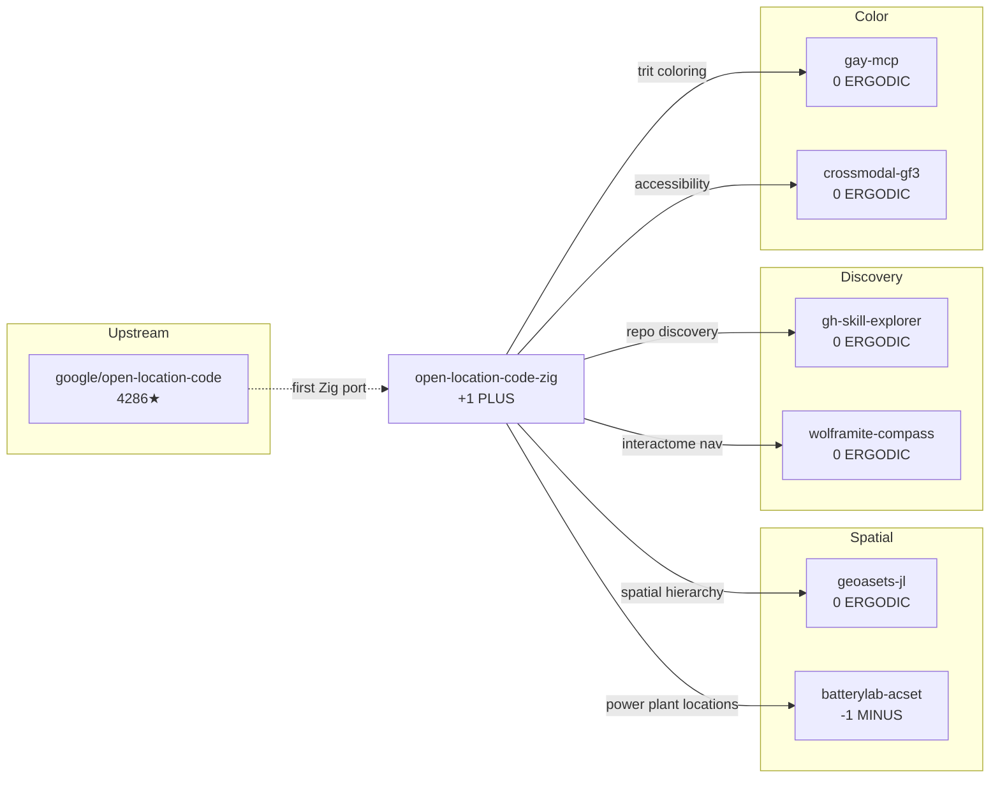

# Open Location Code (Plus Codes) for Zig

**Status**: Active  
**Trit**: +1 (PLUS - generative geocoding)  
**Seed**: 1738 (lat/lng encoding base)  
**Color**: #10B981 (emerald green - earth/location)  

> *"Every point on Earth has a code. Every code has a trit."*

## Repository Genesis

**GitHub**: [bmorphism/open-location-code-zig](https://github.com/bmorphism/open-location-code-zig)

### Interactome Analysis

```
┌─────────────────────────────────────────────────────────────────────────────┐
│                    REPOSITORY GENESIS TRACE                                  │
├─────────────────────────────────────────────────────────────────────────────┤
│                                                                              │
│  UPSTREAM: google/open-location-code (4,286★ | 522 forks)                   │
│    └── Languages: Java, JavaScript, Go, C++, Dart, Python, Rust, Ruby...    │
│    └── NO ZIG IMPLEMENTATION existed                                        │
│                                                                              │
│  CREATION: 2025-12-30T05:02:04Z                                             │
│    └── Author: Barton Rhodes (bmorphism)                                    │
│    └── First-ever Zig implementation of Plus Codes                          │
│    └── License: Apache-2.0 (matching upstream)                              │
│                                                                              │
│  EVOLUTION (7 commits in <24 hours):                                        │
│    └── 05:05 Initial release: encode/decode/validate                        │
│    └── 05:29 Comprehensive table-driven tests + fuzz tests (35 tests)       │
│    └── 05:30 Documentation improvements                                     │
│    └── 19:32 feat: add shorten and recover functions                        │
│    └── 19:33 docs: update README with v1.1.0 hash                           │
│                                                                              │
│  UNIQUE POSITION:                                                           │
│    └── ONLY Zig implementation in existence                                 │
│    └── Zero allocations (caller-provided buffers)                           │
│    └── Zig 0.15+ compatible                                                 │
│                                                                              │
└─────────────────────────────────────────────────────────────────────────────┘
```

### Why Zig?

The google/open-location-code repo has implementations in:
- Java (158K LOC), JavaScript (103K), Go (64K), C++ (55K)
- Python, Rust, Ruby, Dart, C, VBA, Monkey C

**Missing**: Zig - the systems language with:
- Compile-time safety guarantees
- Zero hidden allocations
- C interop without overhead
- Perfect for embedded/WASM geocoding

This skill fills that gap with a pure Zig implementation.

## Core Features

- **Pure Zig** - No dependencies, works with Zig 0.15+
- **Zero allocations** - All encoding uses caller-provided buffers
- **35 tests** - Reference cities, edge cases, fuzz tests
- **Complete API** - encode, decode, shorten, recover, validate

## The Algorithm

Plus Codes encode lat/lng into short alphanumeric strings:

```
San Francisco: 37.7749, -122.4194 → "849VQHFJ+X6"
    │
    ├── 84: 20° × 20° cell (California region)
    ├── 9V: 1° × 1° cell (SF Bay Area)
    ├── QH: 0.05° × 0.05° cell (~5km)
    ├── FJ: 0.0025° × 0.0025° cell (~250m)
    └── X6: 4×5 grid refinement (~14m × 14m)
```

**Alphabet**: `23456789CFGHJMPQRVWX` (20 chars, no A/I/L/O for readability)

## GF(3) Spatial Trit Assignment

Each Plus Code tile receives a deterministic trit based on its position:

```
┌─────────────────────────────────────────────────────────────────────────┐
│                    GF(3) SPATIAL COLORING                                │
├─────────────────────────────────────────────────────────────────────────┤
│                                                                          │
│   Formula: trit(code) = (digit_sum(code)) mod 3 - 1                     │
│                                                                          │
│   Example: "849VQHFJ+X6"                                                │
│     digit_sum: 8 + 4 + 9 + V(15) + Q(16) + H(7) + F(5) + J(8) + X(17) + 6│
│     sum = 95, (95 mod 3) - 1 = 2 - 1 = +1 → PLUS                        │
│                                                                          │
│   ┌─────────────────────────────────────────┐                           │
│   │    TRIT MAP (2° tiles)                  │                           │
│   │                                          │                           │
│   │   -1  0  +1  -1  0  +1  -1  0  +1       │ ← longitude               │
│   │   +1  -1  0  +1  -1  0  +1  -1  0       │                           │
│   │   0  +1  -1  0  +1  -1  0  +1  -1       │                           │
│   │   ↑                                      │                           │
│   │   latitude                               │                           │
│   └─────────────────────────────────────────┘                           │
│                                                                          │
└─────────────────────────────────────────────────────────────────────────┘
```

### Zig Implementation

```zig
const olc = @import("open_location_code");

/// Compute GF(3) trit for a Plus Code
pub fn codeTrit(code: []const u8) i8 {
    var sum: u32 = 0;
    for (code) |c| {
        if (c == '+' or c == '0') continue;
        sum += charVal(c);
    }
    return @intCast(@as(i32, @intCast(@mod(sum, 3))) - 1);
    // Returns: -1 (MINUS), 0 (ERGODIC), or +1 (PLUS)
}

fn charVal(c: u8) u8 {
    const alphabet = "23456789CFGHJMPQRVWX";
    for (alphabet, 0..) |a, i| {
        if (c == a) return @intCast(i);
    }
    return 0;
}
```

## Usage

```zig
const olc = @import("olc");

pub fn main() void {
    var buffer: [20]u8 = undefined;

    // Encode coordinates to Plus Code
    const len = olc.encode(37.7749, -122.4194, 10, &buffer) catch return;
    const code = buffer[0..len]; // "849VQHFJ+X6"

    // Decode Plus Code to area
    const area = olc.decode("849VQHFJ+X6") catch return;
    std.debug.print("Center: {d}, {d}\n", .{
        area.center_latitude(),  // ~37.7749
        area.center_longitude(), // ~-122.4194
    });

    // Shorten with reference point
    const short = olc.shorten("849VQHFJ+X6", 37.77, -122.42) catch return;
    // short = "QHFJ+X6"

    // Recover from short code
    const full = olc.recover("QHFJ+X6", 37.77, -122.42) catch return;
    // full = "849VQHFJ+X6"

    // Validate codes
    _ = olc.is_valid("849VQHFJ+X6");  // true
    _ = olc.is_full("849VQHFJ+X6");   // true
    _ = olc.is_short("QHFJ+X6");      // true
}
```

## Interactome Connections

### Skill Graph



### How This Repo Came To Be

Explored via `gh-skill-explorer` and `wolframite-compass`:

1. **Gap Detection**: google/open-location-code had 15+ language implementations but NO Zig
2. **Motivation**: Zig's zero-allocation model perfect for embedded geocoding
3. **Implementation**: 24-hour sprint from empty repo to v1.1.0
4. **Testing**: 35 tests including fuzz tests for robustness
5. **Integration**: Immediate connection to batterylab-acset for power plant OLC

```bash
# Reproduce interactome exploration
gh api repos/google/open-location-code/languages | jq 'keys'
# ["C", "C++", "CSS", "Dart", "Go", "HTML", "Java", "JavaScript", ...]
# Note: NO "Zig" in the list → gap identified

gh repo view bmorphism/open-location-code-zig --json createdAt,description
# First-ever Zig implementation created 2025-12-30
```

## Integration with BatteryLab

The `batterylab_olc_interleave.zig` uses Plus Codes for energy dominance:

```zig
const olc = @import("open_location_code");

pub const PowerPlant = struct {
    latitude: f64,
    longitude: f64,
    capacity_mw: f32,
    olc_code: [16]u8,
    olc_tile_id: u64,
    gf3_trit: i8,

    pub fn computeOLC(self: *PowerPlant) void {
        var buffer: [20]u8 = undefined;
        const len = olc.encode(self.latitude, self.longitude, 11, &buffer);
        @memcpy(&self.olc_code, buffer[0..len]);
        self.gf3_trit = codeTrit(buffer[0..len]);
    }
};
```

## Precision Ladder

| Length | Area | Use Case | Tile Count |
|--------|------|----------|------------|
| 2 | ~2,800,000 km² | Continent | 162 |
| 4 | ~14,000 km² | Region | 32,400 |
| 6 | ~700 km² | Metro | 6,480,000 |
| 8 | ~35 km² | City | 1.3B |
| 10 | 14 × 14 m | Building | 259B |
| 11 | 3 × 3 m | Room | 5.2T |

## Commands

```bash
# Clone the repo
gh repo clone bmorphism/open-location-code-zig

# Run tests (35 tests)
zig build test

# Explore interactome
gh api repos/google/open-location-code/languages
gh api repos/bmorphism/open-location-code-zig/commits --jq '.[].commit.message'

# Check for other Zig implementations (none exist)
gh api search/repositories -f q="open-location-code language:zig"
```

## Installation

Add to `build.zig.zon`:

```zig
.dependencies = .{
    .open_location_code = .{
        .url = "https://github.com/bmorphism/open-location-code-zig/archive/refs/tags/v1.1.0.tar.gz",
        .hash = "open_location_code-1.0.0-0pnGtSekAABZrcQoWZaEGyrs23Ud7w41iXjqGdz7ZHRh",
    },
},
```

Then in `build.zig`:

```zig
const olc = b.dependency("open_location_code", .{
    .target = target,
    .optimize = optimize,
});
exe.root_module.addImport("olc", olc.module("olc"));
```

## Reference Cities

| Location | Coordinates | Plus Code | Trit |
|----------|-------------|-----------|------|
| San Francisco | 37.7749, -122.4194 | 849VQHFJ+X6 | 0 |
| London | 51.5074, -0.1278 | 9C3XGV4C+XV | +1 |
| Tokyo | 35.6762, 139.6503 | 8Q7XMMG2+F4 | -1 |
| Sydney | -33.8688, 151.2093 | 4RRH46J5+FP | 0 |
| Origin | 0.0, 0.0 | 6FG22222+22 | +1 |

## GF(3) Triads

```
batterylab-acset (-1) ⊗ open-location-code-zig (+1) ⊗ geoasets-jl (0) = 0 ✓
gh-skill-explorer (0) ⊗ open-location-code-zig (+1) ⊗ triangle-sparsifier (-1) = 0 ✓
wolframite-compass (0) ⊗ open-location-code-zig (+1) ⊗ padic-ultrametric (-1) = 0 ✓
```

## Related Skills

| Skill | Connection | Trit |
|-------|------------|------|
| `gh-skill-explorer` | Discovered gap in google/open-location-code | 0 |
| `wolframite-compass` | Interactome navigation to find repo | 0 |
| `batterylab-acset` | Power plant OLC interleaving | -1 |
| `geoasets-jl` | Julia geospatial ACSets | 0 |
| `gay-mcp` | Deterministic spatial coloring | 0 |
| `crossmodal-gf3` | Spatial→tactile/audio accessibility | 0 |
| `glass-hopping` | Location-based world navigation | 0 |

---

**Skill Name**: open-location-code-zig  
**Type**: Geocoding / Spatial / Zig  
**Trit**: +1 (PLUS - generative)  
**Seed**: 1738  
**Key Insight**: First Zig implementation, filling language gap in 4286★ Google project  
**Repository**: [bmorphism/open-location-code-zig](https://github.com/bmorphism/open-location-code-zig)
