# Ordered Locale Visualizations

## A) GF(3) Triadic Locale Frame

The frame of opens with inclusion order (Alexandrov topology on {-1, 0, +1}):

```mermaid
graph TD
    subgraph "Frame of Opens"
        TOP["⊤ = {-1, 0, +1}<br/>Universe"]
        MID["U₂ = {0, +1}<br/>Non-negative"]
        PLUS["U₁ = {+1}<br/>Plus only"]
        BOT["⊥ = ∅<br/>Empty"]
    end
    
    TOP --> MID
    MID --> PLUS
    PLUS --> BOT
    
    style TOP fill:#1a1a2e,stroke:#D8267F,stroke-width:3px,color:#fff
    style MID fill:#1a1a2e,stroke:#26D876,stroke-width:3px,color:#fff
    style PLUS fill:#1a1a2e,stroke:#267FD8,stroke-width:3px,color:#fff
    style BOT fill:#1a1a2e,stroke:#666,stroke-width:2px,color:#aaa
```

## B) Way-Below Relation (≪)

The ≪ order between opens - U ≪ V means U is "compact relative to V":

```mermaid
graph LR
    subgraph "≪ Relation (Way-Below)"
        E["∅"]
        P["{+1}"]
        Z["{0,+1}"]
        A["{-1,0,+1}"]
    end
    
    E -.->|"≪"| P
    E -.->|"≪"| Z
    E -.->|"≪"| A
    P -.->|"≪"| Z
    P -.->|"≪"| A
    Z -.->|"≪"| A
    
    style E fill:#0d1117,stroke:#444,stroke-width:2px,color:#888
    style P fill:#1a1a2e,stroke:#D82626,stroke-width:2px,color:#fff
    style Z fill:#1a1a2e,stroke:#2CD826,stroke-width:2px,color:#fff
    style A fill:#1a1a2e,stroke:#2626D8,stroke-width:2px,color:#fff

    linkStyle 0,1,2,3,4,5 stroke:#D8267F,stroke-width:2px,stroke-dasharray:5
```

## C) Cone and Cocone Constructions

Adding initial (apex) and terminal (coapex) objects to the triadic locale:

```mermaid
graph TD
    subgraph "Cocone (adds terminal ⊤')"
        direction TB
        CC_M["-1"]
        CC_E["0"]
        CC_P["+1"]
        CC_TOP["⊤'<br/>coapex"]
        
        CC_M --> CC_TOP
        CC_E --> CC_TOP
        CC_P --> CC_TOP
    end
    
    subgraph "Original Triadic"
        direction TB
        O_M["-1<br/>MINUS"]
        O_E["0<br/>ERGODIC"]
        O_P["+1<br/>PLUS"]
        
        O_M --> O_E
        O_E --> O_P
    end
    
    subgraph "Cone (adds initial ⊥')"
        direction TB
        C_BOT["⊥'<br/>apex"]
        C_M["-1"]
        C_E["0"]
        C_P["+1"]
        
        C_BOT --> C_M
        C_BOT --> C_E
        C_BOT --> C_P
    end
    
    style CC_TOP fill:#4a1a4a,stroke:#D8267F,stroke-width:3px,color:#fff
    style C_BOT fill:#1a4a4a,stroke:#26D8D8,stroke-width:3px,color:#fff
    style O_M fill:#1a1a2e,stroke:#2626D8,stroke-width:2px,color:#fff
    style O_E fill:#1a1a2e,stroke:#26D826,stroke-width:2px,color:#fff
    style O_P fill:#1a1a2e,stroke:#D82626,stroke-width:2px,color:#fff
    
    style C_M fill:#1a2a2a,stroke:#2626D8,stroke-width:2px,color:#fff
    style C_E fill:#1a2a2a,stroke:#26D826,stroke-width:2px,color:#fff
    style C_P fill:#1a2a2a,stroke:#D82626,stroke-width:2px,color:#fff
    
    style CC_M fill:#2a1a2a,stroke:#2626D8,stroke-width:2px,color:#fff
    style CC_E fill:#2a1a2a,stroke:#26D826,stroke-width:2px,color:#fff
    style CC_P fill:#2a1a2a,stroke:#D82626,stroke-width:2px,color:#fff
```

## D) Galois Connection Triangle

The adjunction triangle between GMRA wavelets, Ordered Locales, and Narya types:

```mermaid
graph TB
    subgraph "Galois Connection Triangle"
        GMRA["GMRA<br/>(Wavelet Frames)<br/>V₀ ⊂ V₁ ⊂ ... ⊂ L²"]
        ORDLOC["OrdLoc<br/>(Ordered Locales)<br/>Frame + ≪ + Open Cones"]
        NARYA["Narya<br/>(Bridge Types)<br/>𝟚 → Type"]
    end
    
    GMRA <-->|"O ⊣ pt<br/>(Stone duality)"| ORDLOC
    ORDLOC <-->|"Bridge ≅ ≪<br/>(HoTT encoding)"| NARYA
    NARYA <-->|"Spectral<br/>(Fourier frame)"| GMRA
    
    style GMRA fill:#2d1b3d,stroke:#D8267F,stroke-width:3px,color:#fff
    style ORDLOC fill:#1b3d2d,stroke:#26D876,stroke-width:3px,color:#fff
    style NARYA fill:#1b2d3d,stroke:#267FD8,stroke-width:3px,color:#fff
    
    linkStyle 0 stroke:#D8267F,stroke-width:2px
    linkStyle 1 stroke:#26D876,stroke-width:2px
    linkStyle 2 stroke:#267FD8,stroke-width:2px
```

## E) Triadic Agent Dispatch as Cocone

Agent trifurcation with GF(3) conservation forming a cocone:

```mermaid
graph TD
    subgraph "Triadic Agent Cocone"
        TASK["Task Input<br/>(seed: 0x42D)"]
        
        MINUS["MINUS Agent<br/>trit = -1<br/>VALIDATOR<br/>🔵 #267FD8"]
        ERGODIC["ERGODIC Agent<br/>trit = 0<br/>COORDINATOR<br/>🟢 #26D876"]
        PLUS["PLUS Agent<br/>trit = +1<br/>GENERATOR<br/>🔴 #D8267F"]
        
        RESULT["Result<br/>Σ trits ≡ 0 (mod 3)<br/>GF(3) conserved"]
    end
    
    TASK --> MINUS
    TASK --> ERGODIC
    TASK --> PLUS
    
    MINUS --> RESULT
    ERGODIC --> RESULT
    PLUS --> RESULT
    
    style TASK fill:#0d1117,stroke:#888,stroke-width:2px,color:#fff
    style MINUS fill:#1a1a3d,stroke:#267FD8,stroke-width:3px,color:#fff
    style ERGODIC fill:#1a3d1a,stroke:#26D876,stroke-width:3px,color:#fff
    style PLUS fill:#3d1a1a,stroke:#D8267F,stroke-width:3px,color:#fff
    style RESULT fill:#2d2d2d,stroke:#FFD700,stroke-width:3px,color:#fff
    
    linkStyle 0,1,2 stroke:#888,stroke-width:2px
    linkStyle 3 stroke:#267FD8,stroke-width:2px
    linkStyle 4 stroke:#26D876,stroke-width:2px
    linkStyle 5 stroke:#D8267F,stroke-width:2px
```

## F) Stone Duality: Opens ⊣ Points

The adjunction between opens functor and points functor:

```mermaid
flowchart LR
    subgraph OrdTop["OrdTop_OC<br/>(Ordered Spaces)"]
        SPACE["(X, ≤, τ)<br/>T₀-ordered space"]
    end
    
    subgraph OrdLoc["OrdLoc<br/>(Ordered Locales)"]
        LOCALE["(L, ∧, ⋁, →, ≪)<br/>Frame + ≪"]
    end
    
    SPACE -->|"O<br/>opens functor"| LOCALE
    LOCALE -->|"pt<br/>points functor"| SPACE
    
    style SPACE fill:#1a1a2e,stroke:#D8267F,stroke-width:2px,color:#fff
    style LOCALE fill:#1a2e1a,stroke:#26D876,stroke-width:2px,color:#fff
    style OrdTop fill:#0d0d1a,stroke:#D8267F,stroke-width:1px,color:#888
    style OrdLoc fill:#0d1a0d,stroke:#26D876,stroke-width:1px,color:#888
    
    linkStyle 0 stroke:#D8267F,stroke-width:3px
    linkStyle 1 stroke:#26D876,stroke-width:3px
```

## G) Directed Interval 𝟚 as Bridge Foundation

The walking arrow underlying all bridge types:

```mermaid
graph LR
    subgraph "Directed Interval 𝟚"
        ZERO["0<br/>(source)"]
        ONE["1<br/>(target)"]
    end
    
    ZERO -->|"unique arrow"| ONE
    
    subgraph "Opens of 𝟚"
        O_EMPTY["∅"]
        O_ONE["{1}"]
        O_BOTH["{0,1}"]
    end
    
    O_EMPTY --> O_ONE
    O_ONE --> O_BOTH
    
    style ZERO fill:#1a1a2e,stroke:#267FD8,stroke-width:3px,color:#fff
    style ONE fill:#2e1a1a,stroke:#D8267F,stroke-width:3px,color:#fff
    style O_EMPTY fill:#0d1117,stroke:#444,stroke-width:1px,color:#888
    style O_ONE fill:#1a1a1a,stroke:#888,stroke-width:1px,color:#fff
    style O_BOTH fill:#1a1a1a,stroke:#ccc,stroke-width:2px,color:#fff
    
    linkStyle 0 stroke:#FFD700,stroke-width:3px
```

---

**Generated by**: PLUS Agent (trit=+1, Luca voice)  
**Seed**: Derivational from ordered_locale.py structure  
**GF(3)**: Σ(-1, 0, +1) = 0 ✓
