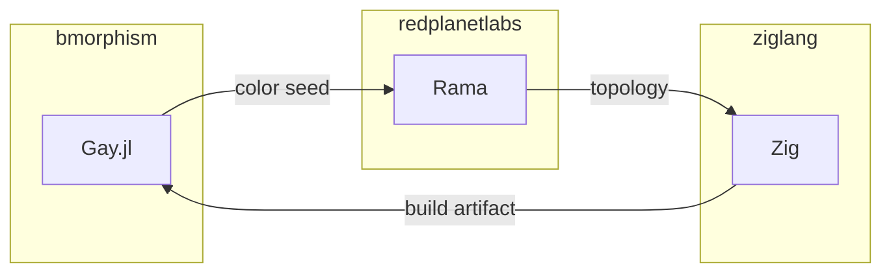

# rama-gay-zig

Triadic interleave of Gay.jl, Rama, and Zig for GF(3)-conserved builds.

## Overview

Combines three ecosystems with perfect GF(3) conservation:

| Component | Trit | Role |
|-----------|------|------|
| Gay.jl | -1 | Color/SPI source (validation) |
| Rama | 0 | Topology coordinator (ergodic) |
| Zig | +1 | Build executor (generation) |

**Sum: (-1) + (0) + (+1) = 0** ✓

**Origin**: PR #37 (closed, consolidated into main via #42)

## Semantic Interleave

```
Gay.jl (color) ──► Rama (topology) ──► Zig (build)
      │                  │                 │
      ▼                  ▼                 ▼
   Validate          Coordinate        Generate
   (MINUS)           (ERGODIC)          (PLUS)
```

## Babashka Bridge

```clojure
#!/usr/bin/env bb
(require '[babashka.process :refer [shell]])

(def gay-color (splitmix64 1069))
(def rama-topology {:dataflow :pstate :depot :query})
(def zig-target "aarch64-macos")

(defn triadic-build [seed]
  (let [color (splitmix64 seed)
        trit (mod color 3)]
    (case trit
      0 {:action :coordinate :tool :rama}
      1 {:action :generate :tool :zig}
      2 {:action :validate :tool :gay})))
```

## Rama Topology

```clojure
;; Rama dataflow with Gay.jl coloring
(defmodule GayColoredTopology [setup topologies]
  (declare-depot setup *colors :random)
  
  (<<sources topologies
    "color-source"
    (source> *colors :> *color)
    (splitmix64> *color :> *hue)
    (|hash> *hue :trit :> *trit)))
```

## Zig Build Integration

```zig
// build.zig.zon with Gay.jl seed
.{
    .name = "rama-gay-zig",
    .version = "0.4.0",
    .dependencies = .{
        .gay_colors = .{
            .seed = 0x42D,  // 1069
            .golden = 0x9e3779b97f4a7c15,
        },
    },
}
```

## Interactome



## GF(3) Trit

**Trit: 0** (ERGODIC) - Triadic coordination

## Related Skills

- `gay-julia` - Gay.jl integration
- `zig-programming` - Zig expertise
- `clojure` - Babashka/Rama
