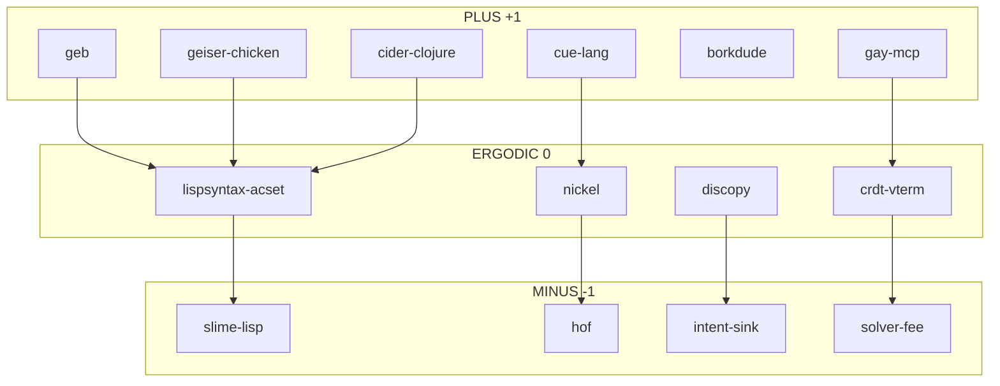

# S-Expression Neighborhood Index (0)

> Complete catalog of sexp-using skills with triadic classification.

**Trit**: 0 (ERGODIC - index/coordinator)

## Master Sexp Skill Taxonomy

```
┌─────────────────────────────────────────────────────────────────────────────┐
│                       SEXP SKILL NEIGHBORHOOD                                │
├─────────────────────────────────────────────────────────────────────────────┤
│                                                                              │
│   PLUS (+1) GENERATIVE              ERGODIC (0) BRIDGE                      │
│   ┌─────────────────────┐          ┌─────────────────────┐                  │
│   │ geb                 │          │ lispsyntax-acset    │                  │
│   │ cue-lang            │          │ nickel              │                  │
│   │ geiser-chicken      │          │ discopy             │                  │
│   │ cider-clojure       │          │ crdt-vterm          │                  │
│   │ borkdude            │          │ og (open-games)     │                  │
│   │ gay-mcp             │          │                     │                  │
│   └─────────────────────┘          └─────────────────────┘                  │
│                                                                              │
│   MINUS (-1) EXTRACTIVE                                                     │
│   ┌─────────────────────┐                                                   │
│   │ slime-lisp          │                                                   │
│   │ hof                 │                                                   │
│   │ intent-sink         │                                                   │
│   │ solver-fee          │                                                   │
│   └─────────────────────┘                                                   │
│                                                                              │
│   GF(3) BALANCED TRIADS:                                                    │
│   geb(+1) + nickel(0) + slime-lisp(-1) = 0 ✓                               │
│   cue-lang(+1) + nickel(0) + hof(-1) = 0 ✓                                 │
│   gay-mcp(+1) + lispsyntax-acset(0) + intent-sink(-1) = 0 ✓                │
│                                                                              │
└─────────────────────────────────────────────────────────────────────────────┘
```

## Complete Skill Index

### PLUS (+1) - Generative/Emissive

| Skill | Description | Sexp Role |
|-------|-------------|-----------|
| **geb** | Anoma categorical semantics | S-exp syntax for morphisms |
| **cue-lang** | Lattice config language | Exports to JSON (sexp-convertible) |
| **geiser-chicken** | Chicken Scheme REPL | Native sexp evaluation |
| **cider-clojure** | Clojure nREPL | EDN sexp format |
| **borkdude** | Babashka runtime | Clojure sexp scripting |
| **gay-mcp** | Deterministic colors | Color sexp nodes |
| **unworld** | Derivation chains | Sexp chain serialization |

### ERGODIC (0) - Bridge/Coordinator

| Skill | Description | Sexp Role |
|-------|-------------|-----------|
| **lispsyntax-acset** | LispSyntax ↔ ACSet | Bidirectional sexp conversion |
| **nickel** | Gradual typing config | JSON export, sexp bridge |
| **discopy** | String diagrams | Diagram ↔ sexp |
| **crdt-vterm** | Terminal CRDT | Sexp-based session recording |
| **og** | Open games | Game state as sexp |
| **ombudsman** | Neutral arbiter | Verifies sexp-encoded chains |

### MINUS (-1) - Extractive/Absorptive

| Skill | Description | Sexp Role |
|-------|-------------|-----------|
| **slime-lisp** | SLIME Common Lisp | Consumes sexp, returns values |
| **hof** | CUE code generation | Consumes config, emits code |
| **intent-sink** | Intent absorption | Nullifies sexp-encoded intents |
| **solver-fee** | Fee extraction | Extracts from sexp matches |

## GF(3) Balanced Triads

### Triad 1: Lisp Dialects
```
geiser-chicken (+1) + lispsyntax-acset (0) + slime-lisp (-1) = 0
     Scheme              Bridge                Common Lisp
```

### Triad 2: Configuration Languages
```
cue-lang (+1) + nickel (0) + hof (-1) = 0
   Lattice       Gradual      Codegen
```

### Triad 3: Anoma/Intent
```
geb (+1) + discopy (0) + intent-sink (-1) = 0
  Types     Diagrams      Nullifiers
```

### Triad 4: Color/State
```
gay-mcp (+1) + crdt-vterm (0) + solver-fee (-1) = 0
  Colors       Sessions         Extraction
```

### Triad 5: Clojure Ecosystem
```
cider-clojure (+1) + borkdude (+1) + lispsyntax-acset (0) = +2
                    UNBALANCED - needs -2 skill
```

**Fix**: Add `clj-kondo-3color` as 0 or create extraction skill.

## Bridge Patterns

### Sexp → ACSet (lispsyntax-acset)

```julia
# Any sexp-producing skill → ACSet
sexp = parse_sexp("(graph (V 1 2 3) (E (1 2) (2 3)))")
acset = acset_of_sexp(GraphSchema, sexp)
```

### Config → Sexp → ACSet

```bash
# CUE/Nickel → JSON → Julia
cue export config.cue | jq '.' > config.json
nickel export config.ncl > config.json
```

```julia
# Julia: JSON → Sexp → ACSet
using JSON3
data = JSON3.read("config.json")
sexp = json_to_sexp(data)
acset = sexp_to_acset(ConfigSchema, sexp)
```

### Geb → Vampir → ZK

```lisp
;; Geb sexp → Vampir IR → ZK proof
(geb-to-vampir 
  (comp (inject-left so1 so1) (terminal so1)))
```

## Neighborhood Graph



## Usage

```bash
# List all sexp skills
grep -l "sexp\|S-expression\|lisp" ~/.claude/skills/*/SKILL.md

# Check GF(3) balance of a triad
python3 -c "
skills = {'geb': 1, 'nickel': 0, 'slime-lisp': -1}
print('Balanced:', sum(skills.values()) % 3 == 0)
"

# Find unbalanced triads
just sexp-audit
```

## Cross-Skill Pipelines

### Pipeline 1: Anoma Intent Compilation
```
Intent (sexp) → Geb (morphism) → Vampir (IR) → ZK (proof)
    +1              +1              0            -1
```

### Pipeline 2: Config-to-Code
```
CUE (schema) → Nickel (contract) → Hof (template) → Code
    +1              0                  -1            output
```

### Pipeline 3: Collaborative Terminal
```
Terminal → crdt-vterm (sexp) → localsend → peer
             0                    0         receive
```

### Pipeline 4: Colored Lisp REPL
```
gay-mcp (color) → geiser (scheme) → display
   +1                 +1             visual
```

## Files

- **This index**: `~/.claude/skills/sexp-neighborhood/SKILL.md`
- **Core bridge**: `~/.claude/skills/lispsyntax-acset/SKILL.md`
- **Geb**: `~/.claude/skills/geb/SKILL.md`
- **Config triad**: `~/.claude/skills/{cue-lang,nickel,hof}/SKILL.md`

---

**Trit**: 0 (ERGODIC - index/coordinator)
**Purpose**: Exhaustive sexp skill awareness
**GF(3)**: Multiple balanced triads documented
