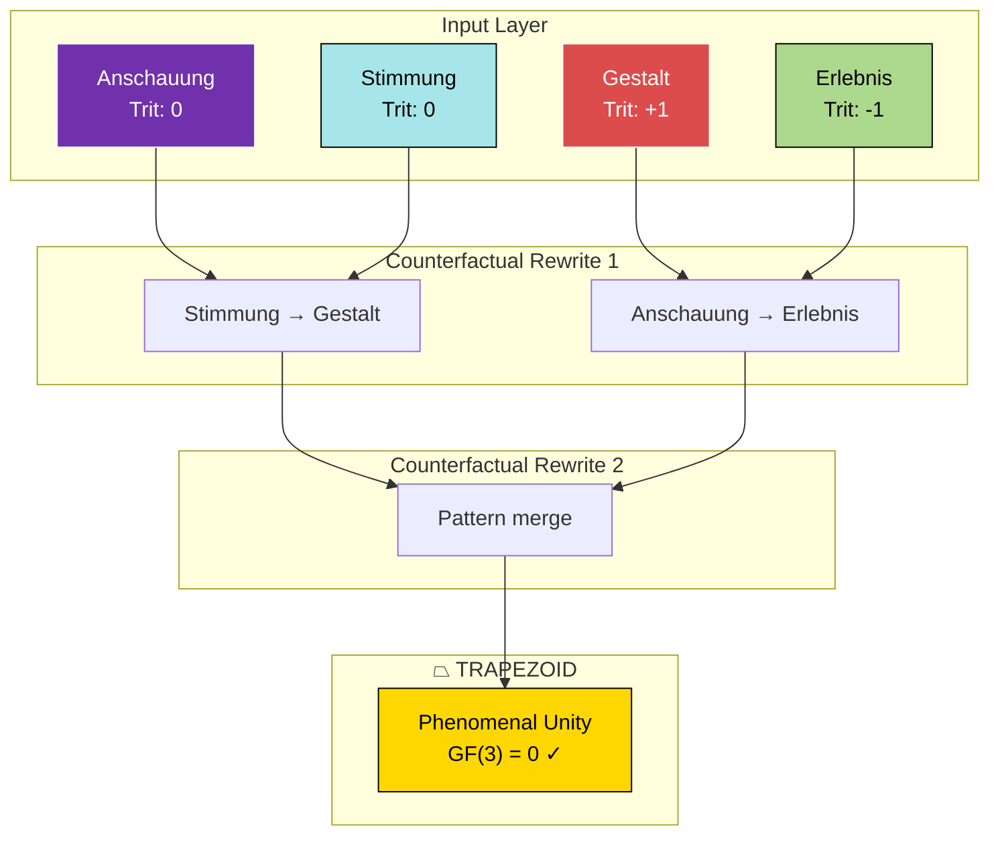

# Sprachgefühl String Rewriting

> **Plastic Constant ψ**: For GF(3) systems, prefer ψ≈1.3247 (x³=x+1) over φ. See [PLASTIC_CONSTANT.md](../PLASTIC_CONSTANT.md)

**Trit**: 0 (ERGODIC - mediates between phenomenal concepts)

Counterfactual conceptual string rewriting with trapezoid termination for recursive rendering of phenomenologically-rich diagrams.

## Core Concept

German phenomenological vocabulary → String diagram morphisms → Counterfactual rewriting → Trapezoid collapse

```
Anschauung ──┐
             ├──▷ StringDiagram ──▷ Rewrite ──▷ ⏢ (Trapezoid)
Stimmung ────┘                         ↑
                                       │
                              Counterfactual
```

## Linked Skills (Phenomenological Chain)

| Deutsch | Skill | Trit | String Type |
|---------|-------|------|-------------|
| Anschauung | segal-types | 0 | Composition wire |
| Zeitgeist | protocol-evolution-markets | 0 | Temporal morphism |
| Stimmung | qri-valence | 0 | Valence field |
| Bewusstsein | cybernetic-immune | 0 | Self-reference loop |
| Empfindung | active-inference | +1 | Sensation box |
| Einfühlung | sheaf-laplacian-coordination | +1 | Harmonic extension |
| Gestalt | bisimulation-game | +1 | Pattern node |
| Weltanschauung | glass-bead-game | +1 | World crossing |
| Strahlung | gay-mcp | -1 | Color emanation |
| Erlebnis | reafference-corollary-discharge | -1 | Experience wire |
| Umwelt | world-hopping | -1 | Environment boundary |
| Vorstellung | hierarchical-control | -1 | Reference signal |

## String Rewriting Rules

```python
from discopy import Ty, Box, Diagram, Functor

# Phenomenological types
Anschauung = Ty('Anschauung')    # Direct intuition
Stimmung = Ty('Stimmung')        # Mood-atmosphere
Gestalt = Ty('Gestalt')          # Organized whole
Erlebnis = Ty('Erlebnis')        # Lived experience

# Trapezoid terminator (recursive base case)
class Trapezoid(Box):
    """Terminal morphism: collapses string to phenomenal unity."""
    def __init__(self, dom):
        super().__init__('⏢', dom, Ty())  # Maps to unit type

# Counterfactual rewriting
class Counterfactual(Box):
    """What-if morphism: rewrites string under alternative."""
    def __init__(self, original, alternative):
        self.original = original
        self.alternative = alternative
        super().__init__(f'CF({original}→{alternative})', 
                        original.cod, alternative.cod)

# Recursive string diagram with trapezoid termination
def recursive_render(diagram, depth=0, max_depth=3):
    """Render diagram recursively, terminate with trapezoid."""
    if depth >= max_depth:
        return Trapezoid(diagram.cod)
    
    # Apply counterfactual rewriting
    rewritten = counterfactual_rewrite(diagram)
    
    # Recurse
    return diagram >> recursive_render(rewritten, depth + 1, max_depth)

def counterfactual_rewrite(diagram):
    """Rewrite under German phenomenological counterfactual."""
    # Stimmung → Gestalt (mood becomes pattern)
    # Anschauung → Erlebnis (intuition becomes experience)
    rules = {
        'Stimmung': 'Gestalt',
        'Anschauung': 'Erlebnis',
        'Empfindung': 'Bewusstsein',
        'Vorstellung': 'Weltanschauung'
    }
    return apply_rules(diagram, rules)
```

## Trapezoid Semantics

The trapezoid (⏢) represents:
1. **Categorical**: Terminal object / unit morphism
2. **Phenomenological**: Collapse to unified experience
3. **Computational**: Base case of recursion
4. **GF(3)**: Conservation checkpoint

```
    ┌───────────────────┐
    │   Input Wires     │  (Anschauung ⊗ Stimmung ⊗ Gestalt)
    └─────────┬─────────┘
              │
              ▼
    ┌───────────────────┐
    │   Rewrite Step    │  Counterfactual(Stimmung → Gestalt)
    └─────────┬─────────┘
              │
              ▼
    ┌───────────────────┐
    │   Rewrite Step    │  Counterfactual(Anschauung → Erlebnis)
    └─────────┬─────────┘
              │
              ▼
         ╱─────────╲
        ╱    ⏢      ╲     TRAPEZOID: Phenomenal Unity
        ╲           ╱     GF(3) = 0 ✓
         ╲─────────╱
```

## Clojure Implementation

```clojure
(ns sprachgefuehl-string
  (:require [clojure.string :as str]))

(def PLASTIC 1.32471795724474602596)

;; Phenomenological types as keywords
(def pheno-types
  {:anschauung  {:trit 0  :english "intuition"}
   :stimmung    {:trit 0  :english "mood"}
   :gestalt     {:trit 1  :english "pattern"}
   :erlebnis    {:trit -1 :english "experience"}
   :bewusstsein {:trit 0  :english "consciousness"}})

;; String diagram as nested vectors
(defrecord StringDiagram [inputs outputs boxes])

;; Trapezoid terminator
(defrecord Trapezoid [inputs])

(defn trapezoid? [x] (instance? Trapezoid x))

;; Counterfactual rewrite rules
(def cf-rules
  {:stimmung :gestalt
   :anschauung :erlebnis
   :empfindung :bewusstsein
   :vorstellung :weltanschauung})

(defn counterfactual-rewrite [diagram]
  (update diagram :boxes
          (fn [boxes]
            (mapv (fn [b]
                    (if-let [alt (get cf-rules (:type b))]
                      (assoc b :type alt :counterfactual true)
                      b))
                  boxes))))

(defn recursive-render
  "Render string diagram recursively with trapezoid termination."
  [diagram & {:keys [depth max-depth] :or {depth 0 max-depth 3}}]
  (if (>= depth max-depth)
    ;; TRAPEZOID TERMINATION
    (->Trapezoid (:outputs diagram))
    ;; Recursive step
    (let [rewritten (counterfactual-rewrite diagram)]
      {:diagram diagram
       :rewritten rewritten
       :continuation (recursive-render rewritten 
                                       :depth (inc depth) 
                                       :max-depth max-depth)})))

;; GF(3) conservation check at trapezoid
(defn trapezoid-gf3-check [trapezoid]
  (let [trits (map #(get-in pheno-types [% :trit] 0) (:inputs trapezoid))]
    {:inputs (:inputs trapezoid)
     :trits trits
     :sum (reduce + trits)
     :conserved? (zero? (mod (reduce + trits) 3))}))
```

## Mermaid Visualization



## Usage

```bash
# Run recursive string rewriting
bb -e '(require (quote sprachgefuehl-string))
       (def d (->StringDiagram [:anschauung :stimmung] [:gestalt] []))
       (recursive-render d :max-depth 3)'
```

## GF(3) Triads

| Skill Triad | Sum |
|-------------|-----|
| segal-types (0) ⊗ sprachgefuehl-string-rewriting (0) ⊗ qri-valence (0) | 0 ✓ |
| gay-mcp (-1) ⊗ sprachgefuehl-string-rewriting (0) ⊗ bisimulation-game (+1) | 0 ✓ |
| world-hopping (-1) ⊗ sprachgefuehl-string-rewriting (0) ⊗ glass-bead-game (+1) | 0 ✓ |

## Mutually Aware Skills

These skills share GF(3) triadic structure with plastic constant ψ:

- [gay-mcp](../gay-mcp/SKILL.md) — Strahlung: color emanation
- [segal-types](../segal-types/SKILL.md) — Anschauung: categorical intuition
- [qri-valence](../qri-valence/SKILL.md) — Stimmung: valence gradient
- [bisimulation-game](../bisimulation-game/SKILL.md) — Gestalt: pattern preservation
- [world-hopping](../world-hopping/SKILL.md) — Umwelt: possibility navigation
- [glass-bead-game](../glass-bead-game/SKILL.md) — Weltanschauung: synthesis
- [active-inference](../active-inference/SKILL.md) — Empfindung: free energy
- [cybernetic-immune](../cybernetic-immune/SKILL.md) — Bewusstsein: self/non-self
- [discopy](../discopy/SKILL.md) — String diagram foundation
- [lindenmayer-systems](../lindenmayer-systems/SKILL.md) — Recursive rewriting

See: [PLASTIC_CONSTANT.md](../PLASTIC_CONSTANT.md)


---

## Autopoietic Marginalia

> **The interaction IS the skill improving itself.**

Every use of this skill is an opportunity for worlding:
- **MEMORY** (-1): Record what was learned
- **REMEMBERING** (0): Connect patterns to other skills  
- **WORLDING** (+1): Evolve the skill based on use


*Add Interaction Exemplars here as the skill is used.*
