# Zulip Cogen Skill 🐸⚡

**Trit**: +1 (PLUS - Generator)
**GF(3) Triad**: `dynamic-sufficiency (-1) ⊗ proof-of-frog (0) ⊗ zulip-cogen (+1) = 0`

## Overview

Code generator from Category Theory Zulip knowledge base with **dynamic sufficiency gating**. Transforms 121k messages into executable artifacts only when sufficient context is verified via ε-machine coverage.

> *"No generation without sufficient witness. The ε-machine observes, the gate permits."*

## Architecture

```
┌─────────────────────────────────────────────────────────┐
│                    ZULIP COGEN                          │
├─────────────────────────────────────────────────────────┤
│  INPUT                    OUTPUT                        │
│  ┌──────────────┐        ┌─────────────────────────┐   │
│  │ CT Zulip     │───────▶│ Lean4 proofs            │   │
│  │ 121k msgs    │        │ Mermaid diagrams        │   │
│  │ 81 ponds     │        │ Julia/Python impls      │   │
│  └──────────────┘        │ ACSet schemas           │   │
│                          └─────────────────────────┘   │
└─────────────────────────────────────────────────────────┘
```

## Generation Modes

| Mode | Input | Output |
|------|-------|--------|
| `proof` | Math discussion | Lean4 theorem |
| `diagram` | Category description | Mermaid/tikzcd |
| `impl` | Algorithm discussion | Julia/Python code |
| `schema` | Data structure talk | ACSet definition |
| `skill` | Topic cluster | SKILL.md |

## Usage

```bash
# Generate Lean4 proof from discussion
zulip-cogen proof "adjoint functors" --pond theory:-category-theory

# Generate diagram from thread
zulip-cogen diagram --thread-id 12345 --format mermaid

# Generate implementation
zulip-cogen impl "kan extension" --lang julia

# Generate ACSet schema
zulip-cogen schema "simplicial sets" 

# Generate skill from pond
zulip-cogen skill --pond theory:-topos-theory
```

## Example Generations

### Proof Mode
```
Input: Discussion about "left adjoints preserve colimits"
Output:
```lean
theorem left_adjoint_preserves_colimits 
    {C D : Category} (F : Functor C D) (G : Functor D C)
    (adj : F ⊣ G) : PreservesColimits F := by
  intro J K c hc
  exact adj.leftAdjointPreservesColimits c hc
```

### Diagram Mode
```
Input: "The Yoneda embedding is fully faithful"
Output:


```mermaid
graph LR
    C[C] -->|y| PSh["[Cᵒᵖ, Set]"]
    subgraph "Yoneda"
        y["y: C → Hom(-, C)"]
    end
    style y fill:#08bed5
```

### Implementation Mode
```
Input: Discussion on "computing left Kan extensions"
Output:
```julia
function left_kan(F::Functor, K::Functor)
    # Lan_K(F)(d) = colim_{(c,k) ∈ (K↓d)} F(c)
    d -> begin
        comma = comma_category(K, d)
        colimit(c -> F(c.source), comma)
    end
end
```

## Pipeline

```python
class ZulipCogen:
    def __init__(self, db_path: str):
        self.db = duckdb.connect(db_path)
        self.gay_seed = 0x6761795f636f6c6f
    
    def generate(self, mode: str, query: str, **kwargs) -> str:
        # 1. Retrieve relevant messages
        context = self.retrieve(query, kwargs.get('pond'))
        
        # 2. Extract structure
        structure = self.extract_structure(context, mode)
        
        # 3. Generate artifact
        return self.synthesize(structure, mode, kwargs.get('lang'))
    
    def retrieve(self, query: str, pond: str = None) -> List[Message]:
        sql = """
            SELECT content, sender, color 
            FROM ct_zulip_messages m
            JOIN ct_zulip_streams s ON m.stream_id = s.id
            WHERE m.content LIKE ?
        """
        if pond:
            sql += " AND s.name LIKE ?"
        return self.db.execute(sql, params).fetchall()
```

## Dynamic Sufficiency Integration

### ε-Machine Gating

Before ANY generation, verify sufficient context:

```python
def pre_generation_gate(query: str, mode: str) -> Verdict:
    """Gate generation on sufficient Zulip context."""
    messages = retrieve(query)
    coverage = compute_coverage(query, messages)
    
    if coverage.score >= 0.7:  # 70% threshold for generation
        return Verdict.PROCEED
    elif coverage.score >= 0.3:
        return Verdict.WARN(f"Low coverage: {coverage.score:.0%}")
    else:
        return Verdict.ABORT(f"Insufficient context: {len(messages)} msgs")
```

### Causal States for Generation

| Causal State | Required Coverage | Artifact |
|--------------|------------------|----------|
| `PROOF_READY` | 3+ math discussions | Lean4 theorem |
| `DIAGRAM_READY` | 2+ structural mentions | Mermaid |
| `IMPL_READY` | 5+ code references | Julia/Python |
| `SCHEMA_READY` | 3+ type discussions | ACSet |

### Variational Bound

```
min(sufficiency) ≤ generation ≤ max(fanout)

dynamic-sufficiency GATES: Prevents generation without context
zulip-cogen GENERATES: Synthesizes artifacts from sufficient context
```

## Frog Lifecycle as Cogen Pipeline

| Stage | Trit | Cogen Phase | Sufficiency Check |
|-------|------|-------------|-------------------|
| 🥒 TADPOLE | -1 | Retrieve context | ε-machine inference |
| 🐸 FROGLET | 0 | Extract structure | Coverage ≥ 0.7 |
| 🦎 MATURE | +1 | Synthesize artifact | Generate if sufficient |

## Integration with Skills

Generated artifacts feed back into skill ecosystem:

```
zulip-cogen skill --pond theory:-type-theory
    ↓
~/.claude/skills/type-theory-ct/SKILL.md
    ↓
proof-of-frog verifies GF(3) balance
```

## Gay.jl Coloring

Each generation gets deterministic color based on query hash:

```python
def generation_color(query: str, mode: str) -> str:
    h = fnv1a(f"{query}:{mode}")
    seed = splitmix64(GAY_SEED ^ h)
    return seed_to_color(seed)
```

## Files

| Path | Purpose |
|------|---------|
| `~/ies/hatchery.duckdb` | CT Zulip archive |
| `~/ies/zulip_cogen.py` | Generator implementation |
| `~/.claude/skills/zulip-cogen/` | Skill definition |

## References

- [CT Zulip Archive](https://github.com/plurigrid/ct-zulip-archive)
- [Mathlib4](https://github.com/leanprover-community/mathlib4)
- [AlgebraicJulia](https://github.com/AlgebraicJulia)
- [cats-for-ai Zulip](https://cats-for-ai.zulipchat.com/)
